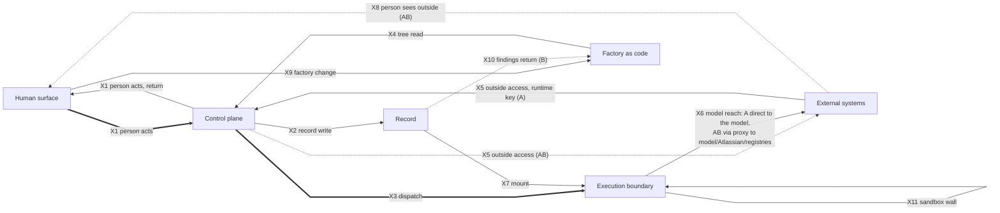

# Layer 1: bird's-eye view

| Field | Value |
|---|---|
| Status | Draft v0.4 |
| Date | 2026-09-10 |
| Owner | Abhishek Thakur |
| Derived from | docs/prd/prd.md v0.18; docs/design/milestones.md v0.6; docs/charter.md v0.14; docs/design/hld/README.md v0.3 (register of record) |
| Layer | Layer 1 — bird's-eye view |
| Domain rule | A component sits in the domain where its code runs or its file lives, and under whose trust it acts; domain 1 is the exception the rule names — it is the person's view, and the code that renders it is the `factory` command (C1). **Human surface**: what the person sees and does; trusted. **Control plane**: the trusted runner, one Python process per `factory` command, no daemon — the command, the state machine and the fence, run orchestration, binding and freshness, the guard, the stage drivers, the checks and gates (C9), external access, git-tree operations. **Execution boundary**: the wall the runner builds around every agent or build run — the runtime adapter and envelope (G1), the launcher, recipe runner, OS policy and loopback proxy (G2) — and the untrusted interior (G3). **Record**: state on disk under `runs/` that the runner alone writes, including the measure views and the frozen baseline (R5). **Factory as code**: versioned content under `factory/`, read-only at run time, every file hashed by the manifest. **External systems**: everything outside the engineer's machine, plus the two host facilities the runner trusts (credential store, scheduler). A data block of `milestones.md` (queue item and decision, question and assumption log, approval and quorum, binding, tag) is one or more tables in the ledger (R1); its contract is drawn where its rows are decided. |

**Legend.** S1 context gathering; S3 spec and plan; S6 human review; S7 PR checks
and merge; X1 person acts; X2 record write; X3 dispatch; X4 tree read; X5 outside access; X6 model reach; X7 mount; X8
person sees outside; X9 factory change; X10 findings return; X11 sandbox wall; H1
person and roles; H2 list view and queue items; H3 questions and assumption log; H4
approvals, waivers and governance view; C1 `factory` command (stage interface); C2
ticket state machine and the fence; C3 run orchestration; C4 binding and freshness
guard; C5 guard; C6 stage drivers; C7 external access; C8 git-tree operations; C9
checks and gates; G1 runtime adapter and invocation envelope; G2 the wall — launcher,
recipe runner, OS policy, loopback proxy; G3 sandbox interior; R1 SQLite ledger; R2
artefact files and per-run directories; R3 git trees; R5 measure views and baseline;
F1 tree and change control; F2 manifest; F3 agent definitions and skills; F4 rubrics
and checklists; F5 context index; F6 policies, configuration and catalogue; F7
scripts; F8 fixtures and evals; E1 Atlassian server (Jira and Confluence); E2 GitHub;
E3 Slack; E4 hosted model endpoint; E5 host credential store and scheduler; E6
package registries and vulnerability feeds.

## How to read this

The big diagram shows all six domains as subgraphs — Human surface, Control plane, Execution boundary, Record, Factory as code, External systems — each holding exactly its register components as nodes (34 total: four on the human surface (H1–H4), nine in the control plane (C1–C9), three in the execution boundary (G1–G3), four in the record (R1–R3 and R5), eight in factory as code (F1–F8), six external (E1–E6)), and the eleven domain-to-domain crossings (X1–X11) as labelled edges between the carrier components the crossings table names (README section 5). Unmarked edges hold from Milestone A. A dotted edge (`-.->`) with an "(AB)" or "(B)" tag means that drawn leg of the crossing holds only from that step. A thick edge (`==>`) marks the main ticket path only: the person's command reaching the runner (X1 person acts, the list view (H2) to the `factory` command (C1)) and the runner dispatching it into the sandbox (X3 dispatch, the stage drivers (C6) to the runtime adapter and envelope (G1)); every other edge — including the return legs of person acts and dispatch — is plain. Where a crossing's "From" or "To" side in the register is a range (the control plane, `C1 to C9`; factory as code, `F1 to F8`), one representative carrier node is drawn instead of fanning every member out: the `factory` command for the runner's writes into the record, the manifest (F2) and every file it references for the tree's read into the runner; the full fan-in and fan-out for those ranges belongs to the Layer 2 files for those domains. Every content-bearing crossing passes the guard (C5) and leaves one `guard_decision` row; the guard's seats are drawn once, in `L2-control-plane.md`, and are not redrawn here or anywhere else. Deliberately left out: anything inside a domain (parts, scripts, tables — Layer 2), the ticket's stage-by-stage walk (`L1-ticket-walk.md`), and every Later-only item, which appears nowhere as a box or edge (see "Not drawn").

Diagram 1 is laid out with Mermaid's ELK renderer (`%%{init: {"layout": "elk", ...}}%%`) and a set of invisible `~~~` ties that hold the six domains in reading order without drawing a visible line or carrying any meaning of their own; a renderer without the ELK layout falls back to Mermaid's default layout, which is still correct but less tidy.

The second, smaller diagram collapses each domain to one plain node and draws the same eleven crossings, with the same marks, for a reader who wants the boundaries alone without the 34-node detail.

## Diagram 1: domains, components and crossings

This is the full picture: six domains, their 34 register components, and the eleven crossings between them, used to check that every component sits in the right domain and every drawn edge is a real crossing.

```mermaid
%%{init: {"layout": "elk", "elk": {"mergeEdges": false, "nodePlacementStrategy": "NETWORK_SIMPLEX"}}}%%
flowchart LR
  subgraph D1["Human surface — trusted"]
    H1["Person and roles (H1)"]
    H2["List view and<br/>queue items (H2)"]
    H3["Questions and<br/>assumption log (H3)"]
    H4["Approvals, waivers<br/>and governance view (H4)"]
  end

  subgraph D2["Control plane — trusted"]
    C1["factory command (C1)<br/>the stage interface"]
    C2["Ticket state machine<br/>and the fence (C2)"]
    C3["Run orchestration (C3)"]
    C4["Binding and<br/>freshness guard (C4)"]
    C5["Guard (C5)"]
    C6["Stage drivers (C6)"]
    C7["External access (C7)"]
    C8["Git-tree operations (C8)"]
    C9["Checks and gates (C9)"]
  end

  subgraph D5["Factory as code — read-only content"]
    F1["Tree and change<br/>control (F1)"]
    F2["Manifest (F2)"]
    F3["Agent definitions<br/>and skills (F3)"]
    F4["Rubrics and<br/>checklists (F4)"]
    F5["Context index (F5)"]
    F6["Policies, configuration<br/>and catalogue (F6)"]
    F7["Scripts (F7)"]
    F8["Fixtures and evals (F8)"]
  end

  subgraph D4["Record — trusted, single writer"]
    R1["SQLite ledger (R1)"]
    R2["Artefact files and<br/>per-run directories (R2)"]
    R3["Git trees (R3)"]
    R5["Measure views<br/>and baseline (R5)"]
  end

  subgraph D3["Execution boundary — wall trusted, interior untrusted"]
    G1["Runtime adapter and<br/>invocation envelope (G1)"]
    G2["The wall: launcher,<br/>recipe runner, OS policy,<br/>loopback proxy (G2)"]
    G3["Sandbox interior (G3)"]
  end

  subgraph D6["External systems — content untrusted"]
    E1["Atlassian server:<br/>Jira and Confluence (E1)"]
    E2["GitHub (E2)"]
    E3["Slack (E3)"]
    E4["Hosted model<br/>endpoint (E4)"]
    E5["Host credential store<br/>and scheduler (E5)"]
    E6["Package registries and<br/>vulnerability feeds (E6)"]
  end

  H2 ==>|"the person's commands and decisions<br/>(X1 person acts)"| C1
  C1 -->|"queue items, status, report, governed artefacts<br/>(X1 person acts)"| H2
  H4 -->|"governance view (metadata-only)<br/>(X1 person acts)"| C1

  C1 -->|"run and ledger rows<br/>(X2 record write)"| R1
  C1 -->|"artefact writes<br/>(X2 record write)"| R2
  C1 -->|"checkouts, worktrees<br/>(X2 record write)"| R3

  C6 ==>|"envelope, recipe requests<br/>(X3 dispatch)"| G1
  C3 -->|"envelope, recipe requests<br/>(X3 dispatch)"| G1

  F2 -->|"read-only by hash<br/>(X4 tree read)"| C1

  C7 -.->|"Jira/Confluence read (AB)<br/>(X5 outside access)"| E1
  C7 -.->|"push, draft PR (AB)<br/>(X5 outside access)"| E2
  C7 -.->|"digest (AB)<br/>(X5 outside access)"| E3
  E5 -->|"credentials by role:<br/>runtime key A, others AB<br/>(X5 outside access)"| C7
  E5 -.->|"invokes factory digest (AB),<br/>never a stage<br/>(X5 outside access)"| C1

  G3 -->|"prompt over the runtime key (A: direct)<br/>(X6 model reach)"| E4
  G2 -.->|"via proxy (AB)<br/>(X6 model reach)"| E4
  G2 -.->|"Atlassian reads at context gathering (S1) (AB)<br/>(X6 model reach)"| E1
  G2 -.->|"registry fetch (AB)<br/>(X6 model reach)"| E6

  R2 -->|"artefact mounts<br/>(X7 mount)"| G2
  R3 -->|"worktree, copies<br/>(X7 mount)"| G2

  E2 -.->|"draft PR (AB)<br/>(X8 person sees outside)"| H1
  E3 -.->|"digest (AB)<br/>(X8 person sees outside)"| H1

  H1 -->|"the engineer's pull request via GitHub<br/>(X9 factory change)"| F1

  R2 -.->|"governed export becomes a fixture by the<br/>engineer's reviewed pull request (B)<br/>(X10 findings return)"| F8

  G2 -->|"mounts, key, digest<br/>(X11 sandbox wall)"| G3

  %% layout hints only: invisible ties, no visible line or meaning
  H1 ~~~ C1
  H1 ~~~ C7
  H1 ~~~ C2
  H3 ~~~ C1
  H4 ~~~ C1
  H2 ~~~ C6
  C7 ~~~ E2
  G2 ~~~ E4
  F2 ~~~ F3
  F4 ~~~ F5
  F6 ~~~ F7
  F1 ~~~ F8
  C2 ~~~ C3
  C4 ~~~ C5
  C8 ~~~ C3
  C6 ~~~ C9
  E5 ~~~ E6

  classDef untrusted fill:#fde8e8,stroke:#b91c1c
  classDef later stroke-dasharray:5 5,color:#666
  classDef content fill:#eef6ff
  classDef store fill:#f3f4f6

  class G3 untrusted
  class E1,E2,E3,E4,E6 untrusted
  classDef hostFacility fill:#fff7ed,stroke:#9a3412
  class E5 hostFacility
  class F1,F2,F3,F4,F5,F6,F7,F8 content
  class R1,R2,R3,R5 store
```

## Diagram 2: domain boundaries only

This is the same eleven crossings with the 34 components collapsed away, for a reader who only wants to see which domain talks to which; each crossing keeps the mark (unmarked, dotted-AB, dotted-B, thick) it carries in diagram 1. The person acts (X1) and outside access (X5) keep their two directions because the marks differ by direction (person acts: thick out, plain back; outside access: dotted-AB out, solid-A the runtime-key return); model reach (X6) has one direction with two marks, so its single edge names both in the label rather than splitting into two overlapping lines.

## Derivation table

### The six domains

| Domain | Name | Trust | Components | First step |
|---|---|---|---|---|
| D1 | Human surface | trusted (the person) | H1, H2, H3, H4 | A |
| D2 | Control plane | trusted | C1, C2, C3, C4, C5, C6, C7, C8, C9 | A |
| D3 | Execution boundary | wall (G1, G2) trusted; interior (G3) untrusted | G1, G2, G3 | A (OS policy and the loopback proxy harden the wall AB) |
| D4 | Record | trusted, single writer | R1, R2, R3, R5 | A (the frozen baseline cohort AB) |
| D5 | Factory as code | read-only content | F1, F2, F3, F4, F5, F6, F7, F8 | A |
| D6 | External systems | content untrusted; the credential store and scheduler are trusted host facilities | E1, E2, E3, E4, E5, E6 | A (fixture stubs and the runtime key); real reads, writes and the other credentials AB |

### The eleven crossings

Matches `README.md` section 5; the last column cites Appendix B's own "Defining rows" for each crossing.

| Id | Crossing | From | To | Holds from | Defining rows (Appendix B) |
|---|---|---|---|---|---|
| X1 | The person acts | H2 (and the governance view of H4) | C1; back from C1 to H2 | A | R-H-1, R-H-4, R-H-8, R-H-12, R-H-13, R-I-1, R-I-4, R-I-8, R-I-9, R-T-4, R-T-6, R-T-9, R-S0-7, R-S3-20, R-S5-13, R-S6-7, R-H-11, R-O-13 |
| X2 | The runner writes and reads its record | C1 to C9 | R1, R2, R3 | A | R-T-1, R-T-3, R-T-5, R-T-9, R-T-10, R-T-12, R-O-1, R-O-4, R-O-5, R-I-15, R-S3-11, R-S3-21, R-S4-1, R-S6-1 |
| X3 | The runner dispatches a run | C6, C3 | G1 | A | R-I-1, R-I-2, R-I-3, R-I-6, R-I-13, R-I-15, R-I-16, R-I-17, R-S4-1, R-S4-2, R-S4-5 |
| X4 | The factory tree is read at run time | F2 (and every file it references) | C1; C9 for the policy files the manifest hashes | A | R-I-4, R-F-1, R-F-4, R-F-5, R-F-11, R-F-13, R-T-9, R-S5-13 |
| X5 | The runner reads from and writes to outside systems | C7 | E1, E2, E3; E5 to C7 (credentials by role) and E5 to C1 (the scheduler invokes `factory digest`) | Runtime key and stubs at A; real reads and writes and the other credentials AB | R-S0-1, R-T-11, R-S6-3, R-S6-6, R-S5-12, R-H-3, R-O-6, R-H-10, R-S7-1, R-S7-3, R-S7-4, R-S7-6 |
| X6 | The agent reaches the hosted model and attached servers | G3 directly at A; G2 (proxy) from AB | E4; E1 at S1 (AB); E6 (AB) | A for the model; AB for the proxy, Atlassian and registry legs | R-I-14, R-I-11, R-I-13, R-I-4, R-S1-4 |
| X7 | Mounts into a run | R2, R3 | G2 | A; copies and the unwritable results subpath of the per-run directory AB | R-T-2, R-I-14, R-I-17, R-S3-6 |
| X8 | The person sees outside systems | E2, E3 | H1 | AB | R-H-3, R-H-11 |
| X9 | The factory changes | H1, via a GitHub pull request | F1 | A | R-F-4, R-F-9, R-F-14 |
| X10 | Run findings return to the tree | R2 (the governed export), by the engineer's reviewed pull request | F8 | B once; the rest Later | R-O-4, R-O-12, R-F-2, R-F-8, R-F-10, R-F-15, R-T-4 |
| X11 | The sandbox wall | G2 (launcher) | G3 | A; OS policy and proxy AB | R-I-14, R-I-3, R-I-11, R-I-16 |

Component and part rows live in the Layer 2 file for each domain, not here.

## Not drawn

Each Later item below is owned by the domain named; its full justification lives in that domain's Layer 2 file, not restated here.

- Read-only MCP server — Later; grows into the stage interface (C1), domain 2; see `L2-control-plane.md`.
- Improvement pass, observer scoring, calibration records, holdout harness and benchmarks — Later; fixtures and evals (F8) grows into it, domain 5; see `L2-factory-as-code.md`.
- Dashboards — Later; the record (R1, R5) grows into it, domain 4; see `L2-record.md`.
- Automating PR checks and merge (S7), GitHub Actions polling and comments, and a read-only GitHub server for it — Later; external access (C7), domain 2; see `L2-control-plane.md` and `L2-external-systems.md`.
- Stacked pull requests — Later; ticket and its state (C2) and artefact (R2), domains 2 and 4; see `L2-control-plane.md` and `L2-record.md`.
- Containers as the sandbox implementation — Later; the wall (G2) grows into it, domain 3; see `L2-execution-boundary.md`.
- The Claude Code adapter and grader invocations — Later; invocation and runtime adapter (G1), domain 3; see `L2-execution-boundary.md`.
- Confluence sync — Later; external access (C7), domain 2; see `L2-control-plane.md` and `L2-external-systems.md`.
- Never drawn per the brief's exclusion list: a push before quorum on outside access (X5); an agent holding a GitHub or Slack credential (no edge reaches the sandbox interior (G3) from external systems — its only external edge is model reach (X6) to the hosted model endpoint (E4)); the sandbox writing the record or the tree (no edge leaves the wall (G2) or the sandbox interior into the record or factory as code); the scheduler starting a stage (the host credential store and scheduler (E5) has only the credential and digest leg of outside access, into external access (C7), not a path into the run-dispatch of the `factory` command (C1)); an approval carried past a change; and the charter's anti-goals (autonomous merge or deploy, a switchable spec-and-plan (S3) or human-review (S6) gate, an LLM grading its own output, cost or throughput as an objective) — none of these has a corresponding node or edge above.
