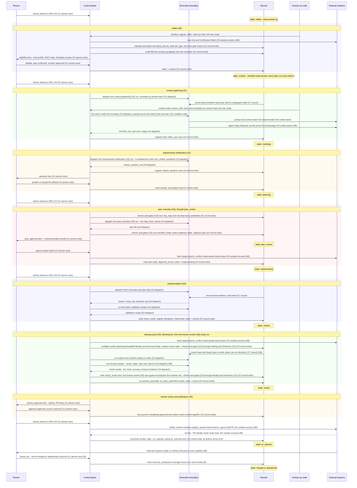
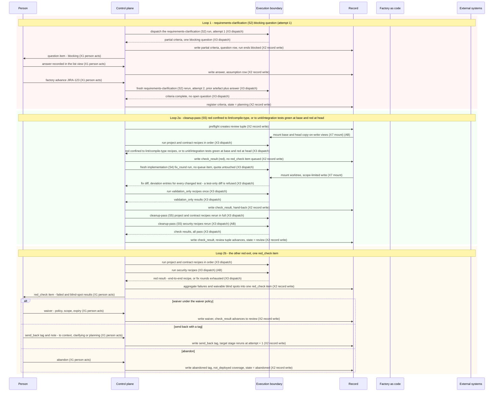

# Layer 1: one ticket across the domains

| Field | Value |
|---|---|
| Status | Draft v0.4 |
| Date | 2026-09-10 |
| Owner | Abhishek Thakur |
| Derived from | docs/prd/prd.md v0.18; docs/design/milestones.md v0.6; docs/charter.md v0.14; docs/design/hld/README.md v0.3 (register of record) |
| Layer | Layer 1 — one ticket's walk across the domains |
| Domain rule | A component sits in the domain where its code runs or its file lives, and under whose trust it acts; domain 1 is the exception the rule names — it is the person's view, and the code that renders it is the `factory` command (C1). **Human surface**: what the person sees and does; trusted. **Control plane**: the trusted runner, one Python process per `factory` command, no daemon — the command, the state machine and the fence, run orchestration, binding and freshness, the guard, the stage drivers, the checks and gates (C9), external access, git-tree operations. **Execution boundary**: the wall the runner builds around every agent or build run — the runtime adapter and invocation envelope (G1), the launcher, recipe runner, OS policy and loopback proxy (G2) — and the untrusted sandbox interior (G3); aliased `G` in the diagrams below, never `X`, so it never collides with the crossing-id labels of the eleven crossings. **Record**: state on disk under `runs/` that the runner alone writes, including the measure views and the frozen baseline (R5). **Factory as code**: versioned content under `factory/`, read-only at run time, every file hashed by the manifest. **External systems**: everything outside the engineer's machine, plus the two host facilities the runner trusts (credential store, scheduler). A data block of `milestones.md` (queue item, question log, approval, binding, tag) is stored in the record; its contract is drawn where its rows are decided (the person's decisions in domain 1, runner-computed rows in domain 2) and its table is listed once under the record's ledger. |

**Legend.** S0 intake; S1 context gathering; S2 requirements clarification; S3 spec and plan; S4 implementation; S5 cleanup pass; S6 human review; S7 PR checks and merge (Later); X1 person acts; X2 record write; X3 dispatch; X4 tree read; X5 outside access; X6 model reach; X7 mount; X8 person sees outside; X9 factory change; X10 findings return; X11 sandbox wall; C1 the `factory` command, the stage interface; C4 binding and freshness guard; C5 guard; C9 checks and gates; G1 runtime adapter and invocation envelope; G2 the wall — launcher, recipe runner, OS policy, loopback proxy; G3 sandbox interior; R5 measure views and baseline.

## How to read this

Both diagrams are `sequenceDiagram`s over the same six participants, in the fixed order the brief sets — Person (`P`), Control plane (`C`), Execution boundary (`G`), Record (`R`), Factory as code (`F`), External systems (`E`) — because a ticket's walk is a sequence of crossings, not a map of components. Record and Factory as code are participants, not stores drawn once, because a record write (X2) and a tree read (X4) into the envelope are themselves crossings the walk makes. An arrow carries a crossing's short name and id in its label so every message traces back to the crossings table; a solid arrow (`->>`) is a call or a write, a dotted arrow (`-->>`) is what comes back (output files, receipts, check results). `rect` blocks group the messages belonging to one PRD stage, opening with a `Note` naming the stage; a trailing `Note over R` gives the ticket state the record is now in — the "Entered from" and "Leaves when" columns of `02-3-ticket-states.md` read as a sequence: `intake` at the top (the state a ticket starts in), `context`, `clarifying`, `planning`, `plan_review` the moment the `plan_approval` item is queued (not only once it clears), `implementing`, `checks`, `review`, `pr_opened`, and `merged` or `abandoned` at the close.

Unmarked messages hold from Milestone A. `(AB)` marks a message that reaches a real outside system only from Milestone AB — at Milestone A the same crossing hits a stub deliverer or, for the two target-branch fetches, the synthetic fixture repository that `milestones.md` materialises outside the manifest hash at the path `project.yaml` names (`docs/design/milestones.md` section 3, item 2); `(B)` marks the manual outcome record, which exists only from Milestone B. Every content-bearing crossing in this walk passes the guard (C5) and leaves one `guard_decision` row; the guard's seats are drawn once, in `L2-control-plane.md`, so no message here names it again. `factory advance <ticket>` runs stages only until the next human touchpoint and exits — one Python process per command, no daemon (`08-configuration.md:112`) — so a fresh `P->>C: factory advance JIRA-123` message follows every human decision that must resume a stage; a loop in diagram 2 with no human touchpoint of its own draws none.

Diagram 1 deliberately omits: the manifest resolving again on every later stage (it is pinned once at intake (S0) and only checked after, per R-I-4); the four Later-only queue-item kinds and the observer/grader path; the scheduled digest, the baseline read, and any crossing to the factory's own change control (X9 factory change, X10 findings return) — none of those carry this one ticket. Diagram 2 shows only the loops the happy path hides; it omits everything diagram 1 already established (the manifest pin, the intake (S0) and context-gathering (S1) messages) and re-enters at the point each loop actually branches off.

## Diagram 1: the happy path, `factory advance` to `pr_opened`

One ticket from the command that opens it to the draft pull request, one message per crossing that matters, grouped by stage from intake (S0) to human review (S6) and closing with the manual outcome record.

## Diagram 2: the loops the happy path hides

Three loops the happy path hides: a requirements-clarification (S2) run ending `blocked` on a question, answered in the list view, and rerun; a cleanup-pass (S5) red result confined to the project's lint, compile/type, unit-test or integration-test recipes — green at base and red at head — taking one fix round back to implementation (S4) with no verification quota consumed and no queue item, refusing a diff that touches only test files; and the other cleanup-pass red exit, one `red_check` item resolved by waiver, send-back with a tag, or abandonment. All three re-enter mid-walk: the manifest is already pinned and intake (S0) and context gathering (S1) already happened.

## Derivation table

One row per PRD stage from intake (S0) to human review (S6) and per loop: what the trusted runner does, what the agent does (script-only stages carry "none"), the human touchpoint, and the requirement or state-table rows behind it.

| Stage | What the runner does | What the agent does | The touchpoint | Rows |
|---|---|---|---|---|
| intake (S0) | Mechanical field gate; R-T-9 classifies and redacts the permitted source fields into `ticket_source`; service-tier, ticket-type and provisional-tier lookups; sensitive-path match; pilot-exclusion check; a script fills the scrutiny paragraph from the R-S0-6 template; pins the resolved manifest hash on the ticket | None: no agent runs at intake (S0); the manifest's intake agent, skill and model entries are null | `eligibility` item: eligible or not, type, data class, tier override, template scrutiny to confirm or edit | R-S0-1, R-S0-2, R-S0-5, R-S0-6, R-S0-7, R-S0-8, R-T-9, R-I-4; `02-3-ticket-states.md`:intake |
| context gathering (S1) | Reads the context index and records `index_use`; computes the final tier; assembles and registers the `brief` | Touched-area discovery via codegraph; two-step archaeology; dependency evidence; writes the fact-only summary | None in the happy path (a blocker is loop 1's requirements-clarification (S2) shape, not context gathering's — context gathering's own blocker is out of this walk) | R-S1-2, R-S1-3, R-S1-4, R-S1-6, R-S1-7, R-S1-8, R-S1-11 |
| requirements clarification (S2) | Dispatches the N restatement child runs for the agreement check; runs the forced-category rubric, question gate, ranker, format and wording validators, classifier, split-rule checker | Restates each criterion in EARS form with one example; raises questions | `question` item: answer or accept the default | R-S2-1, R-S2-2, R-S2-3, R-S2-4, R-S2-5, R-S2-6, R-S2-7, R-S2-8, R-S2-9, R-S2-10, R-S2-11, R-S2-12, R-S2-14 |
| spec and plan (S3), through `plan_review` | Runs `risk_map` in checks and gates (C9) before the invocation and `handoff_ready` after it; assembles the bootstrap checklist; creates the plan tuple; fetches the target branch and checks freshness before commit | Names the three risk-worthy places; writes the plan with its fixed tables | `plan_approval` item: approve the criteria-and-plan bundle, or send back with a tag | R-S3-11, R-S3-15, R-S3-18, R-S3-19, R-S3-20, R-S3-21, R-T-10; `02-3-ticket-states.md`:plan_review |
| implementation (S4) | Pre-task revalidation of subject/base/head, fetching the target (R-S5-12); one fresh invocation per plan task, dispatched into the sandbox; runs each approved recipe exactly once inside the sandbox (R-I-14) and writes only its evidence to the record (R-I-17); tracks the three-verification quota; escalates on the third failure | Implements the task; writes `branch`, `head_sha`, `worktree_path`, the deviation set | None in the happy path | R-S4-1, R-S4-2, R-S4-5, R-S4-6, R-S4-9, R-S4-10, R-I-14, R-I-17, R-S5-12 |
| cleanup pass (S5) | Trusted preflight fetches the target and creates the review tuple, with R-S6-6 final ownership; provisions the base/head sandbox; runs the project and contract recipes, then the security recipes (AB); aggregates failures; the human-review (S6) race guard — checks and gates (C9) through binding and freshness (C4) — recomputes the reviewer set before `packet_assemble`/`pr_body_assemble`; routes to a fix round or the human | None — the cleanup pass is scripts and recipes only | None when every result is `pass` or a validly waived `blind_spot` (loop 2 covers the red exits) | R-S5-1, R-S5-10, R-S5-12, R-S5-13, R-S4-9, R-S4-10, R-S6-6, R-I-14 |
| human review and publication (S6) | The human-review (S6) race guard recomputes the reviewer set from `checks`, before assembly; `packet_assemble` and `pr_body_assemble` scripts; the last quorum-completing approval and the outbox intent commit together in one transaction (R-T-11); outbox selects `pr_create`/`pr_update`, rechecks the subject, dispatches, reconciles the receipt | None | `packet_approval` item: approve or request changes | R-S6-1, R-S6-2, R-S6-3, R-S6-6, R-S6-7, R-S6-10, R-T-11 |
| Loop — requirements-clarification (S2) blocking question | Ends the run `blocked` after finishing independent work; holds the ticket in `clarifying`; reruns from the record at `attempt + 1` once the answer lands | Raises the blocking question through the question gate before the run ends | `question` item, blocking | R-S2-5, R-S2-6, R-S2-7, R-S2-9, R-S2-12, R-S2-14; `02-3-ticket-states.md`:clarifying, "Failed and blocked runs" |
| Loop — cleanup-pass (S5) fix round | Detects a red confined to the project's lint/compile-type recipes, or to a unit-test/integration-test recipe green at base and red at head; returns to `implementing` with no queue item; runs the `validation_only` recipe pass once; reruns the cleanup pass in full; counts the round against the implementation (S4) budget, never the verification quota | Fix-round invocation edits only within the plan's scope table and discretion globs; may change a test this ticket added or a base test the plan lists, never another; a round whose diff touches only test files is refused | None — no human action while rounds remain | R-S4-9, R-S5-1, R-S5-10, R-S4-10 |
| Loop — cleanup-pass (S5) other red exit | Aggregates every failure and waivable blind spot into one `red_check` item once fix rounds are exhausted or do not apply | None | `red_check` item: waiver under R-S5-13, send-back with a tag, or abandon | R-S5-1, R-S5-13; `02-3-ticket-states.md` Send-back paragraph |

## Not drawn

- PR checks and merge (S7) and the `pr_checks` state: all Later (`10-later-items.md`; one-page version, "Explicitly not there").
- The scheduled digest (`factory digest`, R-H-3) and the baseline read (R-O-6): both real crossings, but neither carries this ticket — the digest walks the whole queue and the baseline is a separate utility run frozen once before Milestone B.
- `bloat_signal` (R-F-7, agent definition, domain 5), `close_survey` (R-S7-5, queue item and decision, domain 1), the observer pass and calibration (R-O-10, R-O-11, fixtures and evals, domain 5), and any `score` row: Later — see `docs/prd/06-observability.md`; each is owned by the domain named, not restated here.
- The factory change (X9), the engineer's own factory pull request, and the findings return (X10), a governed export becoming a fixture: both real, but neither is a step in a ticket's own advance — the factory change alters the tree that a later ticket reads, and the findings return happens after this ticket closes, as its own reviewed change.
- Confluence sync, dashboards, the read-only MCP server, stacked pull requests, containers, the Claude Code adapter: Later, owned by domain 2 (external access) and domain 3 (the wall, the adapter) — see `L2-control-plane.md`, `L2-external-systems.md` and `L2-execution-boundary.md`; not restated here.
- Never drawn, per the brief's anti-goals: a push before quorum (the outbox dispatch at human review (S6) follows, never precedes, the last approval); an agent holding a GitHub or Slack credential (Execution boundary only ever reaches External systems for the hosted model, the Atlassian proxy leg at context gathering (S1), and registries at the cleanup pass (S5)); the sandbox writing the record directly (every Record write in both diagrams originates at Control plane); the scheduler starting a stage; an approval carried past a change (the human-review race guard and the cleanup-pass and human-review freshness checks are drawn precisely because they refuse that).
