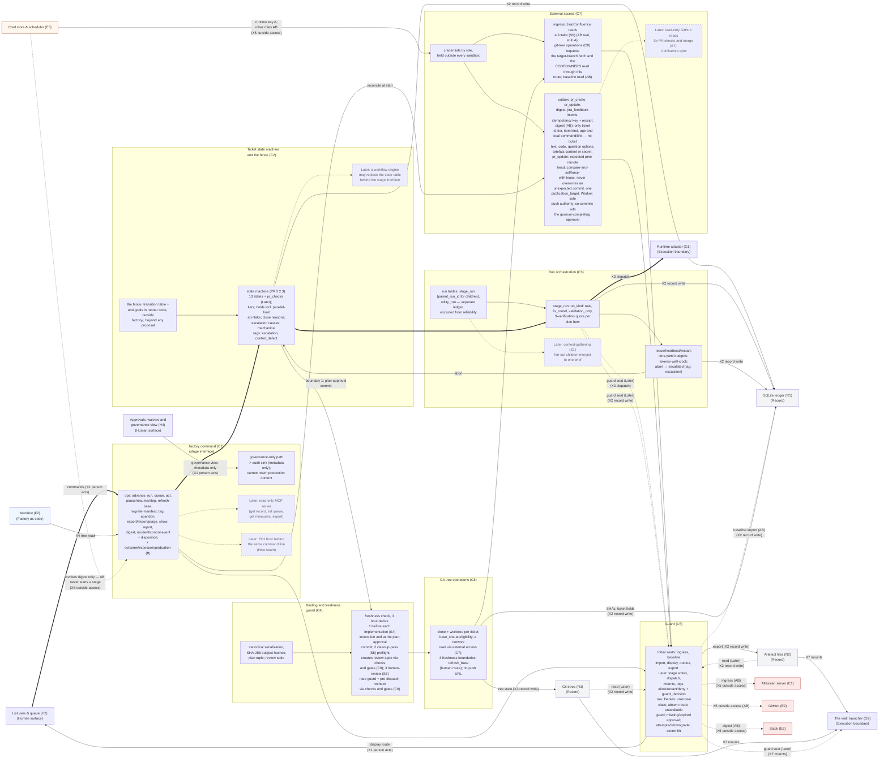
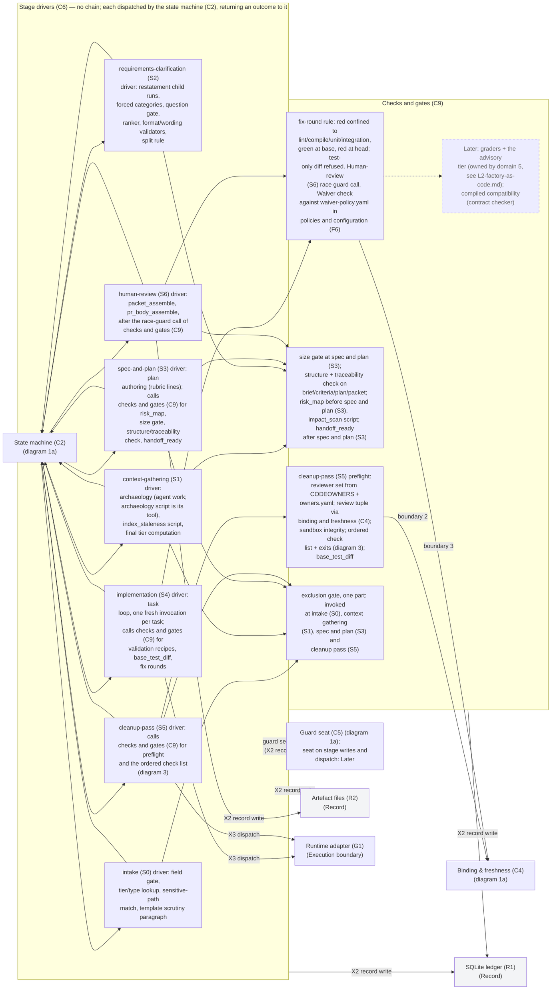
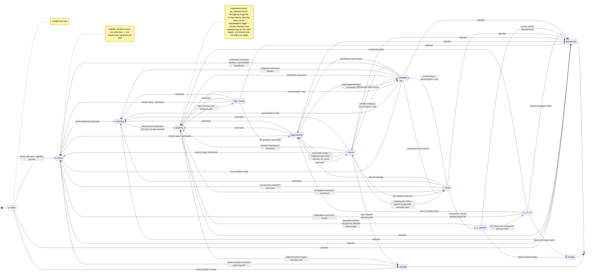
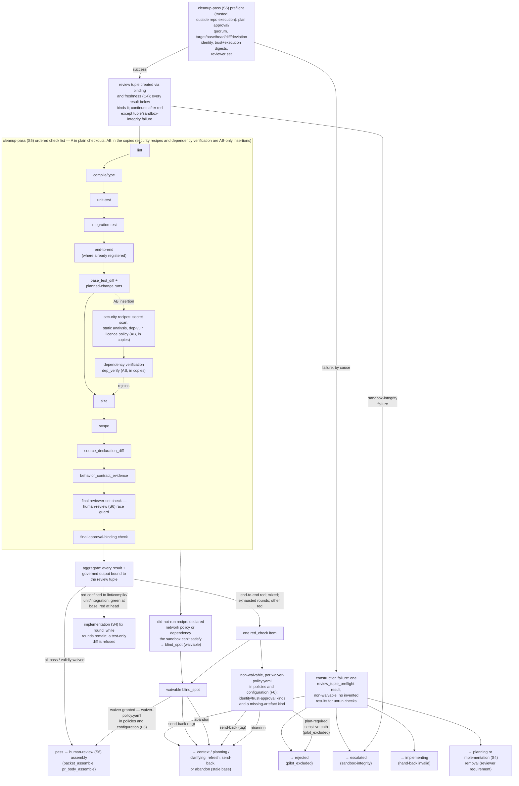

# L2 — Control plane (domain 2)

| Field | Value |
|---|---|
| Status | Draft v0.5 |
| Date | 2026-09-10 |
| Owner | Abhishek Thakur |
| Derived from | `docs/prd/prd.md` v0.18; `docs/design/milestones.md` v0.6; `docs/charter.md` v0.14 |
| Layer | Layer 2 — domain 2, Control plane |
| Domain rule | A component sits in the domain where its code runs or its file lives, and under whose trust it acts. **Control plane**: the trusted runner, one Python process per `factory` command, no daemon. Everything drawn here is trusted-side code that reads and writes the record directly; nothing here is invoked by an agent and nothing here runs inside the execution boundary. |

**Legend.** S0 intake; S1 context gathering; S2 requirements clarification; S3 spec and plan; S4 implementation; S5 cleanup pass; S6 human review; S7 PR checks and merge (Later); X1 person acts; X2 record write; X3 dispatch; X4 tree read; X5 outside access; X7 mount; X11 sandbox wall; C1 `factory` command (stage interface); C2 ticket state machine and the fence; C3 run orchestration; C4 binding and freshness; C5 guard; C6 stage drivers; C7 external access; C8 git-tree operations; C9 checks and gates; H2 list view and queue items; H4 approvals, waivers and governance view; R1 SQLite ledger; R2 artefact files and per-run directories; R3 git trees; F2 manifest; F6 policies, configuration and catalogue; G1 runtime adapter and invocation envelope; G2 the wall (launcher, recipe runner, OS policy, loopback proxy); E1 Atlassian server (Jira and Confluence); E2 GitHub; E3 Slack; E5 host credential store and scheduler.

## How to read

The control plane owns nine components, the `factory` command (C1) through checks and gates (C9). Checks and gates is new in this revision: the exclusion gate, the spec-and-plan (S3) size gate, the R-I-12 structure and R-S3-19 traceability check, `risk_map` and `handoff_ready`, the cleanup-pass (S5) preflight and its ordered check list, `base_test_diff`, the fix-round routing rule, the human-review (S6) race-guard call, and the waiver check against `waiver-policy.yaml`; the stage drivers (C6) keep only the seven stage drivers, intake (S0) to human review (S6), dispatched one at a time by the ticket state machine (C2) and communicating with each other only through the record — no driver-to-driver chain. Diagram 1 splits at 31 and 18 nodes into **1a** (the `factory` command, the state machine, run orchestration, binding and freshness (C4) and the guard (C5)) and **1b** (the stage drivers, checks and gates, external access (C7) and git-tree operations (C8)), because the combined picture passed the 35-node guideline. Each half draws its own border stubs; the state machine and binding and freshness reappear in 1b as small reference stubs pointing back at 1a, since the cleanup-pass preflight of checks and gates calls binding and freshness for the review-tuple boundary, and every stage driver dispatches from and returns an outcome to the state machine.

The control plane's own border crossings are five. **Person acts (X1)**: the list view and queue (H2) to the `factory` command (C1) and back, with a second, metadata-only leg from the governance view of approvals and waivers (H4) into the command's audit sink, which cannot reach production content. **Record write (X2)**: the runner writes and reads its record, the command through checks and gates (C9) into the SQLite ledger (R1), artefact files (R2) and git trees (R3); in Initial the baseline import and the export pass the seat of the guard (C5), the runner's own row writes and the mount-bound reads do not — that seat is Later, PRD R-T-13. **Dispatch (X3)**: the runner dispatches a run, run orchestration (C3) and the stage drivers (C6) to the runtime adapter (G1); the recipes of checks and gates are dispatched by the implementation (S4) and cleanup-pass (S5) drivers that call it, not by checks and gates directly. **Tree read (X4)**: the factory tree is read at run time, the manifest (F2) to the command, which resolves it. **Outside access (X5)**: the runner reads from and writes to outside systems, external access (C7) to and from the Atlassian server (E1), GitHub (E2), Slack (E3) and the host credential store and scheduler (E5); the scheduler also invokes `factory digest` on the command, never a stage. The five are drawn to twelve border stub nodes across the two halves — list view and queue (H2), approvals and governance view (H4), SQLite ledger (R1), artefact files (R2), git trees (R3), manifest (F2), runtime adapter (G1), the wall (G2), Atlassian server (E1), GitHub (E2), Slack (E3) and credential store and scheduler (E5) — and those stubs are not detailed here; each lives in its own domain's Layer 2 file. The guard will also seat on mounts (X7), artefact files and git trees into the wall, once R-T-13 is Initial, even though the mount crossing is not one of the five whose endpoint is a control-plane component: the guard's policy evaluation runs in domain 2, so its seat on that crossing is drawn here per the rule below, not redrawn in `L2-record.md` or `L2-execution-boundary.md`.

**The guard is drawn once, with a seat on every carrier of outside content.** In Initial (PRD R-T-9 as narrowed by decision 55) the guard (C5) seats on the display route of person acts (X1), the `factory` command (C1) to the list view and queue (H2); on outside access (X5) ingress to the Atlassian server (E1); on outbox payloads and the digest to GitHub (E2) and Slack (E3); on the baseline import, `C7_ingress`→`C5_seat`→the SQLite ledger (R1), labelled as a record write (X2); and on the command's export operation to artefact files (R2), also a record write. Each drawn seat is one labelled edge from `C5_seat` to its carrier, and no edge carrying content from or to an outside system bypasses it. The seats R-T-13 defers to Later are drawn dotted and labelled `(Later)`: record-write persistence of what the stages write — the state machine (C2), run orchestration (C3), the stage drivers (C6), git-tree operations (C8) and checks and gates (C9) write the ledger, artefact files and git trees (R3) directly in Initial; dispatch (X3), `C3_kinds`→the runtime adapter (G1) direct in Initial; mounts (X7), artefact files and git trees→the wall (G2) direct in Initial, with the read-back legs into `C5_seat` dotted; and logs, for which no distinct component exists to draw an edge to at this layer, so that seat is stated in prose only — see "Not drawn". The owner deferred these on 2026-09-10 because the factory cannot yet open a real pull request; every artefact row already carries `guard_decision_id`, so the seats attach without a schema change. Every other Layer 2 file states this rule once in its own "How to read" and does not redraw the guard. The credential fetch, the host credential store and scheduler (E5) to external access (C7), is not a guard seat — it is not content, it is a secret the runner holds outside every sandbox — and is drawn as a direct, solid edge labelled "runtime key A; other roles AB" (decision 8/10): the launcher receives it inside the dispatch and supplies it to agent sandboxes only across the sandbox wall (X11); no edge runs from the credential store into domain 3.

Diagram 2 is the ticket state machine of PRD 2.3, `stateDiagram-v2`, drawn once and complete — this is its only drawing; `L2-human-surface.md` diagram 2 is a touchpoint strip with no transition edges of its own. Transition families, each covering several individual edges below: **advance on success** along the thick thirteen-state backbone; **send-back** to `context`, `clarifying` or `planning` from any open item (`plan_review`, `implementing`, `checks`, `review`, `escalated`); **abandon** from any open item, or directly from `context`, `clarifying`, `planning` or `pr_opened`; **escalation**, either stage-specific (budget, sandbox, verification, non-retryable control failure, stop) or a second consecutive failure outside implementation (S4), that is at `context`, `clarifying`, `planning`, `checks` or `review`; **resume from `escalated`** to the same stage after an infrastructure or human-stop cause, or to `planning` (or earlier, for a superseding plan version) after verification exhaustion; **`refresh_base`** to `context`; the **validation-only rerun** after a fix round (R-S4-9), recorded as an implementation run with no state change, so not drawn as an edge; the fix round itself is the drawn `checks → implementing` edge; and **manifest migration** (R-I-4), a human-approved change that returns any state to `context`, shown once as a note rather than thirteen edges. `pr_checks` and its transitions belong to PR checks and merge (S7) and are Later, shown with a dashed node border and `(Later)` on every edge, since `stateDiagram-v2` has no dotted-edge syntax.

Diagram 3 is the cleanup-pass (S5) blocking-tier gate as a flow: preflight (creating the review tuple via binding and freshness (C4)), the ordered check list as one solid Milestone-A chain through every check that exists at A — marked once on the subgraph as "A in plain checkouts; AB in the copies" — with the security recipes and dependency verification as the only AB-only insertions, a recipe that cannot run becoming a waivable `blind_spot`, preflight failures fanned out by cause exactly as 2.3's `checks` row states them, the final reviewer-set and approval-binding checks named separately, and the `red_check` item's three exits: waiver to the human-review (S6) assembly run, send-back with a tag, or abandon, with sandbox-integrity failure routed to `escalated` on its own edge rather than folded into the non-waivable list.

Unmarked parts are Milestone A; `(AB)` and `(B)` in a label mark parts that first exist at that step; `(Later)` marks a dashed node joined by one dotted edge to the part it grows from. A thick edge (`==>`) marks the main ticket-advancing path only. `classDef store` (grey) marks Record-domain stubs, `classDef content` (blue) marks the Factory-as-code stub; `classDef untrusted` (red) marks external-systems stubs and is not applied to the runtime adapter (G1) or the wall (G2) — trusted wall code, per the charter's trust rule, even though they sit in the execution boundary domain — or to the host credential store and scheduler (E5), which takes `classDef hostFacility` (tan): the credential store and scheduler are a trusted host facility per README section 2, not untrusted content. The diagrams deliberately leave out: the internal machinery of every border stub, every Later item as an active box (advisory tier, PR-checks polling, the read-only MCP server, the host and orchestrator seams, the second adapter — see "Not drawn"), and the full 131-row requirement text (the derivation table below carries the row ids).

### Diagram 1a — command, state machine, run orchestration, binding, guard (31 nodes: 19 interior, 12 border stubs)

The requirement rows behind diagram 1a's parts are in the derivation table below: the `factory` command's disposition operation (R-I-1) and its Later MCP server (R-I-9); the parallel-limit hold (R-I-10) and the fence (R-F-11); the utility-run exclusion (R-T-12) and the verification quota (R-S4-5); the Later fan-out (R-S1-10); the subject hashes and tuples (R-T-10); the guard's Initial seats (R-T-9) and its Later seats (R-T-13); and the digest field rule (R-H-3) with the Later GitHub reads and Confluence sync (R-H-10).

### Diagram 1b — stage drivers, checks and gates, external access reference, git-tree reference (18 nodes: 12 interior, 6 border/reference stubs)

`C2_stub`, `C4_stub` and `C5_stub` are the same components as diagram 1a's state machine (C2), binding and freshness (C4) and the guard (C5), repeated here only as dispatch/return and persistence-seat targets so this half reads on its own. In Initial the dispatch (X3) edges and the record writes (X2) from the stage drivers (C6) and checks and gates (C9) reach the runtime adapter (G1), the SQLite ledger (R1) and artefact files (R2) directly, as drawn; the seat of the guard on those writes and dispatches is Later (PRD R-T-13), drawn as one dotted edge. Drivers write the record only through the runner's own record and registry functions, never through a stage's sandbox.

The rows behind each driver and each check are in the derivation table below; the plan-authoring rubric lines the spec-and-plan driver runs are R-S3-2 to R-S3-14, and the exclusion gate is R-S0-8.

### Diagram 2 — the ticket state machine, PRD 2.3, drawn once and complete

The manifest migration that returns any state to `context` is PRD R-I-4, a human-approved change; the parallel-limit hold at `intake` is R-I-10, whose capacity raise is at Milestone B.

### Diagram 3 — the cleanup-pass (S5) blocking-tier gate

The gate's rows are in the derivation table below: the preflight and ordered check list (R-S5-1, R-S5-2, R-S5-4, R-S5-5, R-S5-10), the reviewer set and race guard (R-S6-6), the planned-change runs behind `base_test_diff` (R-S4-10), the fix-round rule (R-S4-9) and the waiver policy (R-S5-13).

## Derivation table

One row per component or part drawn above. Block is the row's own Appendix A primary block (`docs/design/milestones.md` the map at lines 264–454); a block in parentheses is that row's Appendix A secondary. First step is the row's own Appendix A milestone. The stage drivers (C6) and checks and gates (C9) are listed as separate groups since decision 5 splits them.

### The command through the guard — C1 to C5

| Component / part | Block (Appendix A) | Requirement rows | First step |
|---|---|---|---|
| C1 `factory` command (ops node) | Stage interface | R-I-1 (B), R-I-8 (secondary: ticket and its state), R-I-9 (Later), R-H-13 | A (command and most ops; R-I-1 complete at B) |
| C1 governance-only audit sink | Trust profile (secondary: guard) | R-T-9 (charter C9's governance carve-out) | A |
| C1 Later: MCP server | Stage interface | R-I-9 | Later |
| C1 Later: host seam | Stage interface | milestones.md:84 (Host extension point) | Later |
| C2 state machine | Ticket and its state | R-T-5, R-S0-2, R-S1-8, R-S1-11 (secondary: queue item and decision), R-S2-12 (secondary: run), R-S4-6 (secondary: tag), R-I-4 (manifest migration returns any state to `context`), R-I-10 (B, secondary: approval and quorum) | A (capacity-raise sub-feature at B) |
| C2 fence | Factory tree and change control | R-F-11 | A |
| C2 Later: orchestrator seam | Ticket and its state; stage interface | milestones.md:85 (Orchestrator extension point) | Later |
| C3 run tables | Run | R-T-12 (secondary: record) | A |
| C3 run-kind values + quota | Run | R-S4-5 (secondary: binding), R-S4-9 (secondary: check), R-I-6 (secondary: ticket and its state) | A |
| C3 lease/heartbeat/restart | Run | R-T-12, R-O-1 (secondary: external access) | A |
| C3 Later: context-gathering fan-out children | Run | R-S1-10 | Later |
| C4 canonical serialization + subject hashes | Binding | R-T-10 (secondary: approval and quorum) | A |
| C4 freshness check (3 boundaries) | Binding | R-S3-15 (secondary: approval and quorum), R-S5-12 (secondary: git trees), R-S6-10 (secondary: approval and quorum), R-S4-5 (secondary: binding), R-S6-6 (secondary: binding) | A |
| C5 guard seat on outside content: ingress, baseline import, display, outbox, export | Trust profile (secondary: guard) | R-T-9, R-T-4 (secondary: guard) | A |
| C5 seat on stage writes, dispatch, mounts and logs | Guard | R-T-13 | Later |

### The stage drivers — C6

A driver spans several blocks, since it runs rubric lines, check scripts and data-block writes together; the Block column names the block each cited row actually belongs to (primary, or secondary in parentheses) and every id is drawn here as the driver that runs it, not as that row's block home.

| Component / part | Block (Appendix A) | Requirement rows | First step |
|---|---|---|---|
| C6_s0 intake (S0) driver | External access (R-S0-1); ticket and its state (R-S0-5, R-S0-6); queue item and decision (R-S0-7) | R-S0-1 (AB, secondary: check), R-S0-5 (secondary: approval and quorum), R-S0-6, R-S0-7 (secondary: approval and quorum) | A (R-S0-1's Atlassian leg AB) |
| C6_s1 context-gathering (S1) driver | Rubric (R-S1-2, R-S1-3, R-S1-6); external access (R-S1-4); context index (R-S1-7) | R-S1-2, R-S1-3 (secondary: context index), R-S1-4 (AB, secondary: rubric), R-S1-6, R-S1-7 (secondary: tag) | A (R-S1-4's Atlassian leg AB) |
| C6_s2 requirements-clarification (S2) driver | Question and assumption log (R-S2-5, R-S2-6, R-S2-7, R-S2-9, R-S2-14); rubric (R-S2-1, R-S2-4, R-S2-10); run (R-S2-3) | R-S2-1 (secondary: artefact), R-S2-3 (secondary: manifest), R-S2-4 (secondary: question and assumption log), R-S2-5, R-S2-6, R-S2-7, R-S2-9, R-S2-10 (secondary: question and assumption log), R-S2-14 | A |
| C6_s3 spec-and-plan (S3) driver | Rubric (R-S3-2, R-S3-3, R-S3-4, R-S3-5, R-S3-6, R-S3-7, R-S3-9, R-S3-10); artefact (R-S3-14) | The plan-authoring rubric lines are R-S3-2 to R-S3-14: R-S3-2, R-S3-3, R-S3-4, R-S3-5, R-S3-6, R-S3-7, R-S3-9, R-S3-10, R-S3-14 (block: artefact) here, the rest with the checks they gate | A |
| C6_s4 implementation (S4) driver | Artefact | R-S4-1, R-S4-2 | A |
| C6_s5 cleanup-pass (S5) driver | — (drivers only; the check content is C9's) | — | A |
| C6_s6 human-review (S6) driver | Artefact | R-S6-1, R-S6-2 | A |

### Checks and gates — C9, new

| Component / part | Block (Appendix A) | Requirement rows | First step |
|---|---|---|---|
| C9_excl exclusion gate | Check (secondary: ticket and its state) | R-S0-8 | A |
| C9_struct structure/traceability + risk_map/handoff_ready | Rubric (R-S3-11, secondary: artefact); artefact (R-I-12, R-S3-19, R-S3-21) | R-S3-11, R-S3-12 (check), R-I-12 (secondary: check), R-S3-19, R-S3-21 (secondary: check) | A |
| C9_preflight cleanup-pass preflight + ordered check list | Check (AB) | R-S5-1, R-S5-2 (AB, secondary: sandbox), R-S5-4, R-S5-5, R-S5-10, R-S6-6 (primary: approval and quorum, secondary: binding), R-S4-10 (secondary: git trees) | A (plain-checkout subset; R-S5-4, R-S5-5, R-S5-10 at A); AB (full, in copies, with security recipes and R-S5-2's dependency verification) |
| C9_fixround fix rounds, race guard, waiver check | Run (R-S4-9, secondary: check) | R-S4-9, R-S6-3 (external access, AB, secondary: binding), R-S6-6 (the race-guard call), R-S5-13 (approval and quorum, secondary: binding) | A |
| C9 Later: graders + advisory tier; compiled compatibility | Agent definition (R-S5-8, secondary: rubric); check (R-S5-5's Later extension) | R-S5-8 (owned by domain 5, see `L2-factory-as-code.md`), milestones.md:88 (Contract checker extension point) | Later |

### External access and git-tree operations — C7, C8

| Component / part | Block (Appendix A) | Requirement rows | First step |
|---|---|---|---|
| C7 ingress reads | External access | R-S0-1, R-S1-4 | A (stub reads); AB (real Atlassian reads) |
| C7 outbox + worker | External access | R-T-11 (secondary: ticket and its state), R-S6-3 (secondary: binding), R-H-3 (AB, secondary: queue item and decision) | A (stub deliverer, contract); AB (push authority; R-H-3's digest write) |
| C7 Later: GitHub reads, Confluence sync | External access | R-H-10 | Later |
| C8 git-tree operations | Git trees | R-S5-12 (binding, secondary: git trees), R-S4-10 (check, secondary: git trees) | A |

## Not drawn

- Read-only MCP server over the stage interface (R-I-9): Later; drawn as the dashed node of the `factory` command (C1) (diagram 1a).
- The host seam (an EC2 host behind the same `factory` command line) and the orchestrator seam (a workflow engine behind the state table): Later extension points, no PRD row; drawn as the dashed nodes of the `factory` command (C1) and the state machine (C2) (diagram 1a), per `milestones.md`'s Extension-points table (lines 84–85).
- `factory` command's outcome/exposure/coverage/graduation operations (R-I-1's B-half) and the parallel-ticket capacity raise (R-I-10, B): shown only as `(B)` inline on `C1_ops`, and as the parallel-limit hold on `C2_states`, not as separate nodes.
- Advisory tier / sliced advisory pass (R-S5-8, owned by domain 5, see `L2-factory-as-code.md`; R-S5-11) and compiled-compatibility contract checking: Later, drawn as the dashed node of checks and gates (C9) (diagram 1b); not part of the blocking gate in diagram 3.
- Context-gathering (S1) fan-out children merged to one brief (R-S1-10, Later): drawn as the dashed node of run orchestration (C3) (diagram 1a).
- PR-checks polling for PR checks and merge (S7), `pr_checks_summary`, `sync_pr_head`, `close_survey`, `human_signal` reads, and Confluence sync (all Later, R-S7-*, R-H-10): shown as the `(Later)` state and edges in diagram 2, and as the dashed node of external access (C7) (diagram 1a).
- Second runtime adapter (Claude Code, Later): belongs to the execution-boundary domain's own file; the runtime adapter (G1) is drawn here only as a border stub.
- Impact-method swap (import scan vs. dependency tree, `milestones.md:87`): a Later extension point on the Check block, but it is drawn where it executes, inside the sandbox recipe catalogue — see `L2-execution-boundary.md`, not here.
- Log content as a distinct guarded carrier (R-T-13, Later): no register component exists to draw a separate edge to at this layer; when that row is Initial, log writes ride inside the write seat on the SQLite ledger (R1) and artefact files (R2), not a twelfth carrier — stated in prose only (see the guard paragraph above).
- Never drawn, per the anti-goal list: a push before quorum (the edges of `C5_seat` to GitHub (E2) and Slack (E3) are dotted-AB, labelled through the outbox, which pushes only after full quorum); an agent holding a GitHub or Slack credential (only `C7_outbox`, trusted-side, touches those two, and the runtime key travelling outside access (X5), dispatch (X3) and the sandbox wall (X11) never reaches domain 3 from the host credential store and scheduler (E5) directly — no edge from the credential store into the runtime adapter (G1) or the wall (G2)); the sandbox writing the record or the tree (no edge from the runtime adapter or the wall back into the SQLite ledger (R1), artefact files (R2) or the manifest (F2)); the scheduler starting a stage (the credential store and scheduler's edges reach only `C7_cred` for credentials and `C1_ops` for the `factory digest` invocation, never the state machine (C2), run orchestration (C3), the stage drivers (C6) or checks and gates (C9)); a switchable spec-and-plan (S3) or human-review (S6) gate; cost or throughput as an objective; a crossing carrying outside content that bypasses the guard (C5) (the solid edge from `C5_seat` to GitHub in v0.1, which duplicated the guarded outbox path at Milestone A, is removed). The runner's own record writes (X2) and the mount-bound reads are drawn direct in v0.4: their seat is Later under R-T-13, not a bypass.
