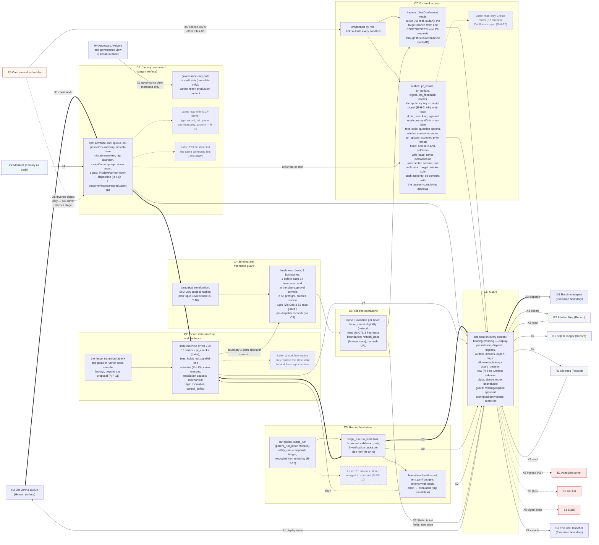
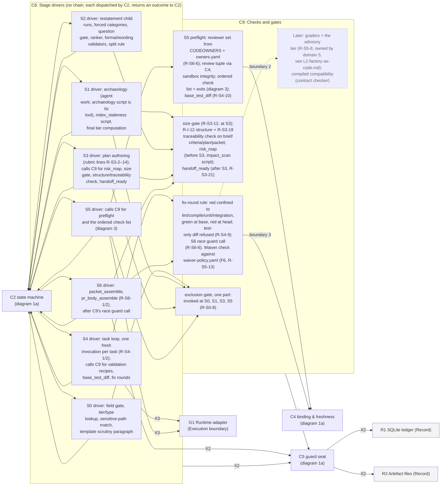
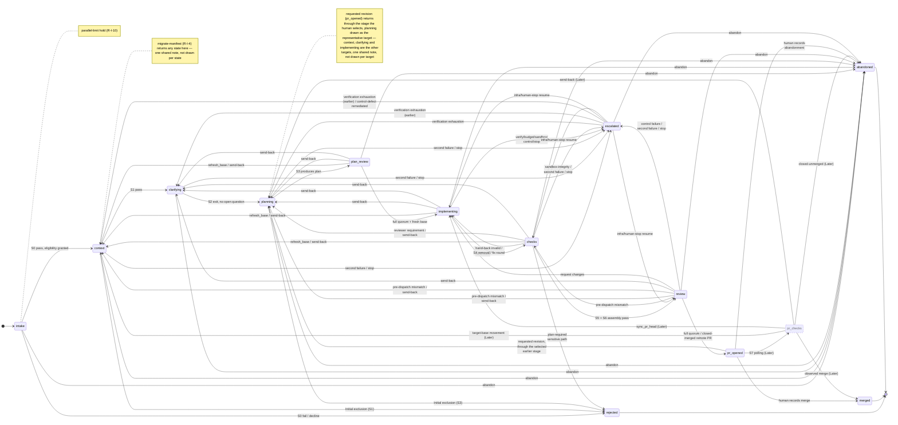
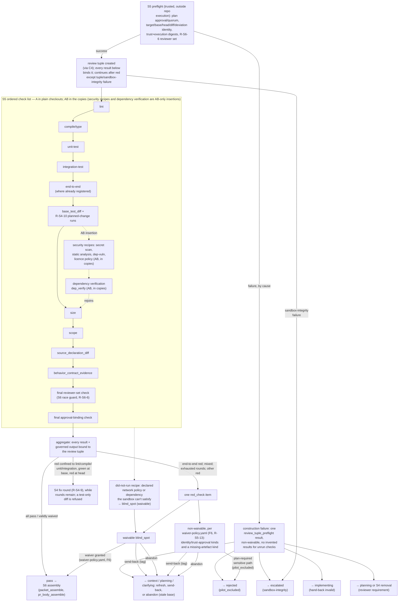

# L2 — Control plane (domain 2)

| Field | Value |
|---|---|
| Status | Draft v0.3 |
| Date | 2026-09-07 |
| Owner | Abhishek Thakur |
| Derived from | `docs/prd/prd.md` v0.18; `docs/design/milestones.md` v0.6; `docs/charter.md` v0.14 |
| Layer | Layer 2 — domain 2, Control plane |
| Domain rule | A component sits in the domain where its code runs or its file lives, and under whose trust it acts. **Control plane**: the trusted runner, one Python process per `factory` command, no daemon. Everything drawn here is trusted-side code that reads and writes the record directly; nothing here is invoked by an agent and nothing here runs inside the execution boundary. |

## How to read

The control plane owns nine components, `C1` to `C9` (`C9`, Checks and gates, is new in this revision: the exclusion gate, the S3 size gate, the R-I-12 structure and R-S3-19 traceability check, `risk_map` and `handoff_ready`, the S5 preflight and its ordered check list, `base_test_diff`, the fix-round routing rule, the S6 race-guard call, and the waiver check against `waiver-policy.yaml`; `C6` keeps only the seven stage drivers, S0 to S6, dispatched one at a time by `C2` and communicating with each other only through the record — no driver-to-driver chain). Diagram 1 splits at 31 and 18 nodes into **1a** (`C1`–`C5`: command, state machine, run orchestration, binding and the guard) and **1b** (`C6`, `C9`, `C7`, `C8`: stage drivers, checks and gates, external access, git-tree operations), because the combined picture passed the 35-node guideline. Each half draws its own border stubs; `C2` and `C4` reappear in 1b as small reference stubs pointing back at 1a, since `C9`'s S5 preflight calls `C4` for the review-tuple boundary, and every stage driver in `C6` dispatches from and returns an outcome to `C2`.

The control plane's own border crossings are five: `X1` (the person acts, `H2`↔`C1`; a second, metadata-only leg from `H4`'s governance view into `C1`'s audit sink, which cannot reach production content), `X2` (the runner writes and reads its record, `C1`–`C9`→`R1`–`R3`, every write and every mount-bound read passing `C5`'s seat), `X3` (the runner dispatches a run, `C3`/`C6`→`G1`; `C9`'s recipes are dispatched by the S4 and S5 drivers that call it, not by `C9` directly), `X4` (the factory tree is read at run time, `F2`→`C1`), and `X5` (the runner reads from and writes to outside systems, `C7`↔`E1`/`E2`/`E3`/`E5`; `E5` also invokes `factory digest` on `C1`, never a stage), drawn to twelve border stub nodes across the two halves (`H2`, `H4`, `R1`, `R2`, `R3`, `F2`, `G1`, `G2`, `E1`, `E2`, `E3`, `E5`) — those stubs are not detailed here; each lives in its own domain's Layer 2 file. The guard (`C5`) also seats on `X7` (mounts, `R2`/`R3`→`G2`) even though `X7` itself is not one of the five crossings whose endpoint is a control-plane component: the guard's policy evaluation runs in domain 2, so its seat on that crossing is drawn here per the rule below, not redrawn in `L2-record.md` or `L2-execution-boundary.md`.

**The guard is drawn once, with a seat on every carrier.** `C5` seats on `X1`'s display route (`C1`→`H2`), `X2` persistence (every write from `C2`, `C3`, `C6`, `C8` and `C9` fans in to `C5_seat`, which alone writes `R1`, `R2` and `R3`, each edge labelled `X2`; the two record legs read back into the seat for mounting, `R2`/`R3`→`C5_seat`, are labelled `X2 read`), `X3` dispatch (→`G1`), `X5` ingress (→`E1`), `X5` outbox payloads and the digest (→`E2`, `E3`), `X7` mounts (`C5_seat`→`G2`, labelled "mounts"), the `C1` export operation (→`R2`, labelled `X2 export`), and logs (R-T-9 names logs among the seated carriers; no distinct component exists to draw a twelfth edge to at this layer, so the seat is stated in prose only — see "Not drawn"); each drawn seat is one labelled edge from `C5_seat` to its carrier, and no content-bearing edge in this file bypasses it. Every other Layer 2 file states this rule once in its own "How to read" and does not redraw the guard. The credential fetch (`E5`→`C7`) is not a guard seat — it is not content, it is a secret the runner holds outside every sandbox — and is drawn as a direct, solid edge labelled "runtime key A; other roles AB" (decision 8/10): the launcher receives it inside the dispatch (`X3`) and supplies it to agent sandboxes only across `X11`; no edge runs from `E5` into domain 3.

Diagram 2 is the ticket state machine of PRD 2.3, `stateDiagram-v2`, drawn once and complete — this is its only drawing; `L2-human-surface.md` diagram 2 is a touchpoint strip with no transition edges of its own. Transition families, each covering several individual edges below: **advance on success** along the thick thirteen-state backbone; **send-back** to `context`, `clarifying` or `planning` from any open item (`plan_review`, `implementing`, `checks`, `review`, `escalated`); **abandon** from any open item, or directly from `context`, `clarifying`, `planning` or `pr_opened`; **escalation**, either stage-specific (budget, sandbox, verification, non-retryable control failure, stop) or a second consecutive failure outside S4 (`context`, `clarifying`, `planning`, `checks`, `review`); **resume from `escalated`** to the same stage after an infrastructure or human-stop cause, or to `planning` (or earlier, for a superseding plan version) after verification exhaustion; **`refresh_base`** to `context`; the **validation-only rerun** after a fix round (R-S4-9), recorded as an S4 run with no state change, so not drawn as an edge; the fix round itself is the drawn `checks → implementing` edge; and **manifest migration** (R-I-4), a human-approved change that returns any state to `context`, shown once as a note rather than thirteen edges. `pr_checks` and its transitions are Later, shown with a dashed node border and `(Later)` on every edge, since `stateDiagram-v2` has no dotted-edge syntax.

Diagram 3 is the S5 blocking-tier gate as a flow: preflight (creating the review tuple via `C4`), the ordered check list as one solid Milestone-A chain through every check that exists at A — marked once on the subgraph as "A in plain checkouts; AB in the copies" — with the security recipes and dependency verification as the only AB-only insertions, a recipe that cannot run becoming a waivable `blind_spot`, preflight failures fanned out by cause exactly as 2.3's `checks` row states them, the final reviewer-set and approval-binding checks named separately, and the `red_check` item's three exits: waiver to the S6 assembly run, send-back with a tag, or abandon, with sandbox-integrity failure routed to `escalated` on its own edge rather than folded into the non-waivable list.

Unmarked parts are Milestone A; `(AB)` and `(B)` in a label mark parts that first exist at that step; `(Later)` marks a dashed node joined by one dotted edge to the part it grows from. A thick edge (`==>`) marks the main ticket-advancing path only. `classDef store` (grey) marks Record-domain stubs, `classDef content` (blue) marks the Factory-as-code stub; `classDef untrusted` (red) marks external-systems stubs and is not applied to `G1`/`G2` (trusted wall code, per the charter's trust rule, even though they sit in the execution boundary domain) or to `E5` (`classDef hostFacility`, tan: the credential store and scheduler are a trusted host facility per README section 2, not untrusted content). The diagrams deliberately leave out: the internal machinery of every border stub, every Later item as an active box (advisory tier, S7 polling, the read-only MCP server, the host and orchestrator seams, the second adapter — see "Not drawn"), and the full 131-row requirement text (the derivation table below carries the row ids).

### Diagram 1a — command, state machine, run orchestration, binding, guard (31 nodes: 19 interior, 12 border stubs)

### Diagram 1b — stage drivers, checks and gates, external access reference, git-tree reference (18 nodes: 12 interior, 6 border/reference stubs)

`C2_stub`, `C4_stub` and `C5_stub` are the same components as diagram 1a's `C2`, `C4` and `C5`, repeated here only as dispatch/return and persistence-seat targets so this half reads on its own; every `X3` dispatch edge below passes `C5`'s seat (drawn fully in diagram 1a), and every `X2` write from `C6` or `C9` passes through `C5_stub` before it reaches `R1`/`R2` — no driver writes the record directly.

### Diagram 2 — the ticket state machine, PRD 2.3, drawn once and complete

### Diagram 3 — the S5 blocking-tier gate

## Derivation table

One row per component or part drawn above. Block is the row's own Appendix A primary block (`docs/design/milestones.md` the map at lines 264–454); a block in parentheses is that row's Appendix A secondary. First step is the row's own Appendix A milestone. `C6` and `C9` are listed as separate groups since decision 5 splits them.

### C1 to C5

| Component / part | Block (Appendix A) | Requirement rows | First step |
|---|---|---|---|
| C1 `factory` command (ops node) | Stage interface | R-I-1 (B), R-I-8 (secondary: ticket and its state), R-I-9 (Later), R-H-13 | A (command and most ops; R-I-1 complete at B) |
| C1 governance-only audit sink | Trust profile (secondary: guard) | R-T-9 (charter C9's governance carve-out) | A |
| C1 Later: MCP server | Stage interface | R-I-9 | Later |
| C1 Later: host seam | Stage interface | milestones.md:84 (Host extension point) | Later |
| C2 state machine | Ticket and its state | R-T-5, R-S0-2, R-S1-8, R-S1-11 (secondary: queue item and decision), R-S2-12 (secondary: run), R-S4-6 (secondary: tag), R-I-10 (B, secondary: approval and quorum) | A (capacity-raise sub-feature at B) |
| C2 fence | Factory tree and change control | R-F-11 | A |
| C2 Later: orchestrator seam | Ticket and its state; stage interface | milestones.md:85 (Orchestrator extension point) | Later |
| C3 run tables | Run | R-T-12 (secondary: record) | A |
| C3 run-kind values + quota | Run | R-S4-5 (secondary: binding), R-S4-9 (secondary: check), R-I-6 (secondary: ticket and its state) | A |
| C3 lease/heartbeat/restart | Run | R-T-12, R-O-1 (secondary: external access) | A |
| C3 Later: S1 fan-out children | Run | R-S1-10 | Later |
| C4 canonical serialization + subject hashes | Binding | R-T-10 (secondary: approval and quorum) | A |
| C4 freshness check (3 boundaries) | Binding | R-S3-15 (secondary: approval and quorum), R-S5-12 (secondary: git trees), R-S6-10 (secondary: approval and quorum), R-S4-5 (secondary: binding), R-S6-6 (secondary: binding) | A |
| C5 guard seat | Trust profile (secondary: guard) | R-T-9, R-T-4 (secondary: guard) | A |

### C6 (stage drivers only)

A driver spans several blocks, since it runs rubric lines, check scripts and data-block writes together; the Block column names the block each cited row actually belongs to (primary, or secondary in parentheses) and every id is drawn here as the driver that runs it, not as that row's block home.

| Component / part | Block (Appendix A) | Requirement rows | First step |
|---|---|---|---|
| C6_s0 S0 driver | External access (R-S0-1); ticket and its state (R-S0-5, R-S0-6); queue item and decision (R-S0-7) | R-S0-1 (AB, secondary: check), R-S0-5 (secondary: approval and quorum), R-S0-6, R-S0-7 (secondary: approval and quorum) | A (R-S0-1's Atlassian leg AB) |
| C6_s1 S1 driver | Rubric (R-S1-2, R-S1-3, R-S1-6); external access (R-S1-4); context index (R-S1-7) | R-S1-2, R-S1-3 (secondary: context index), R-S1-4 (AB, secondary: rubric), R-S1-6, R-S1-7 (secondary: tag) | A (R-S1-4's Atlassian leg AB) |
| C6_s2 S2 driver | Question and assumption log (R-S2-5, R-S2-6, R-S2-7, R-S2-9, R-S2-14); rubric (R-S2-1, R-S2-4, R-S2-10); run (R-S2-3) | R-S2-1 (secondary: artefact), R-S2-3 (secondary: manifest), R-S2-4 (secondary: question and assumption log), R-S2-5, R-S2-6, R-S2-7, R-S2-9, R-S2-10 (secondary: question and assumption log), R-S2-14 | A |
| C6_s3 S3 driver | Rubric (R-S3-2, R-S3-3, R-S3-4, R-S3-5, R-S3-6, R-S3-7, R-S3-9, R-S3-10); artefact (R-S3-14) | R-S3-2, R-S3-3, R-S3-4, R-S3-5, R-S3-6, R-S3-7, R-S3-9, R-S3-10, R-S3-14 (block: artefact) | A |
| C6_s4 S4 driver | Artefact | R-S4-1, R-S4-2 | A |
| C6_s5 S5 driver | — (drivers only; the check content is C9's) | — | A |
| C6_s6 S6 driver | Artefact | R-S6-1, R-S6-2 | A |

### C9 (checks and gates, new)

| Component / part | Block (Appendix A) | Requirement rows | First step |
|---|---|---|---|
| C9_excl exclusion gate | Check (secondary: ticket and its state) | R-S0-8 | A |
| C9_struct structure/traceability + risk_map/handoff_ready | Rubric (R-S3-11, secondary: artefact); artefact (R-I-12, R-S3-19, R-S3-21) | R-S3-11, R-S3-12 (check), R-I-12 (secondary: check), R-S3-19, R-S3-21 (secondary: check) | A |
| C9_preflight S5 preflight + ordered check list | Check (AB) | R-S5-1, R-S5-2 (AB, secondary: sandbox), R-S5-4, R-S5-5, R-S5-10, R-S6-6 (primary: approval and quorum, secondary: binding), R-S4-10 (secondary: git trees) | A (plain-checkout subset; R-S5-4, R-S5-5, R-S5-10 at A); AB (full, in copies, with security recipes and R-S5-2's dependency verification) |
| C9_fixround fix rounds, race guard, waiver check | Run (R-S4-9, secondary: check) | R-S4-9, R-S6-3 (external access, AB, secondary: binding), R-S5-13 (approval and quorum, secondary: binding) | A |
| C9 Later: graders + advisory tier; compiled compatibility | Agent definition (R-S5-8, secondary: rubric); check (R-S5-5's Later extension) | R-S5-8 (owned by domain 5, see `L2-factory-as-code.md`), milestones.md:88 (Contract checker extension point) | Later |

### C7, C8

| Component / part | Block (Appendix A) | Requirement rows | First step |
|---|---|---|---|
| C7 ingress reads | External access | R-S0-1, R-S1-4 | A (stub reads); AB (real Atlassian reads) |
| C7 outbox + worker | External access | R-T-11 (secondary: ticket and its state), R-S6-3 (secondary: binding), R-H-3 (AB, secondary: queue item and decision) | A (stub deliverer, contract); AB (push authority; R-H-3's digest write) |
| C7 Later: GitHub reads, Confluence sync | External access | R-H-10 | Later |
| C8 git-tree operations | Git trees | R-S5-12 (binding, secondary: git trees), R-S4-10 (check, secondary: git trees) | A |

## Not drawn

- Read-only MCP server over the stage interface (R-I-9): Later; drawn as `C1`'s dashed node (diagram 1a).
- The host seam (an EC2 host behind the same `factory` command line) and the orchestrator seam (a workflow engine behind the state table): Later extension points, no PRD row; drawn as `C1`'s and `C2`'s dashed nodes (diagram 1a), per `milestones.md`'s Extension-points table (lines 84–85).
- `factory` command's outcome/exposure/coverage/graduation operations (R-I-1's B-half) and the parallel-ticket capacity raise (R-I-10, B): shown only as `(B)` inline on `C1_ops` and `C2_states`, not as separate nodes.
- Advisory tier / sliced advisory pass (R-S5-8, owned by domain 5, see `L2-factory-as-code.md`; R-S5-11) and compiled-compatibility contract checking: Later, drawn as `C9`'s dashed node (diagram 1b); not part of the blocking gate in diagram 3.
- S1 fan-out children merged to one brief (R-S1-10, Later): drawn as `C3`'s dashed node (diagram 1a).
- S7 PR-checks polling, `pr_checks_summary`, `sync_pr_head`, `close_survey`, `human_signal` reads, and Confluence sync (all Later, R-S7-*, R-H-10): shown as the `(Later)` state and edges in diagram 2, and as `C7`'s dashed node (diagram 1a).
- Second runtime adapter (Claude Code, Later): belongs to the execution-boundary domain's own file; `G1` is drawn here only as a border stub.
- Impact-method swap (import scan vs. dependency tree, `milestones.md:87`): a Later extension point on the Check block, but it is drawn where it executes, inside the sandbox recipe catalogue — see `L2-execution-boundary.md`, not here.
- Log content as a distinct guarded carrier (R-T-9 names logs among the seated carriers): no register component exists to draw a separate edge to at this layer; log writes ride inside the already-guarded `R1`/`R2` writes, not a twelfth carrier — stated in prose only (see the guard paragraph above).
- Never drawn, per the anti-goal list: a push before quorum (`C5_seat`'s edges to `E2`/`E3` are dotted-AB, labelled through the outbox, which pushes only after full quorum); an agent holding a GitHub or Slack credential (only `C7_outbox`, trusted-side, touches `E2`/`E3`, and the runtime key on `X5`/`X3`/`X11` never reaches domain 3 from `E5` directly — no edge from `E5` into `G1` or `G2`); the sandbox writing the record or the tree (no edge from `G1`/`G2` back into `R1`/`R2`/`F2`); the scheduler starting a stage (`E5`'s edges reach only `C7_cred` for credentials and `C1_ops` for the `factory digest` invocation, never `C2`/`C3`/`C6`/`C9`); a switchable S3 or S6 gate; cost or throughput as an objective; a content-bearing crossing that bypasses `C5` (the solid `C5_seat`→`E2` edge of v0.1, which duplicated the guarded outbox path at Milestone A, is removed; every `X2` write and mount-bound read now also passes `C5_seat`/`C5_stub`).
