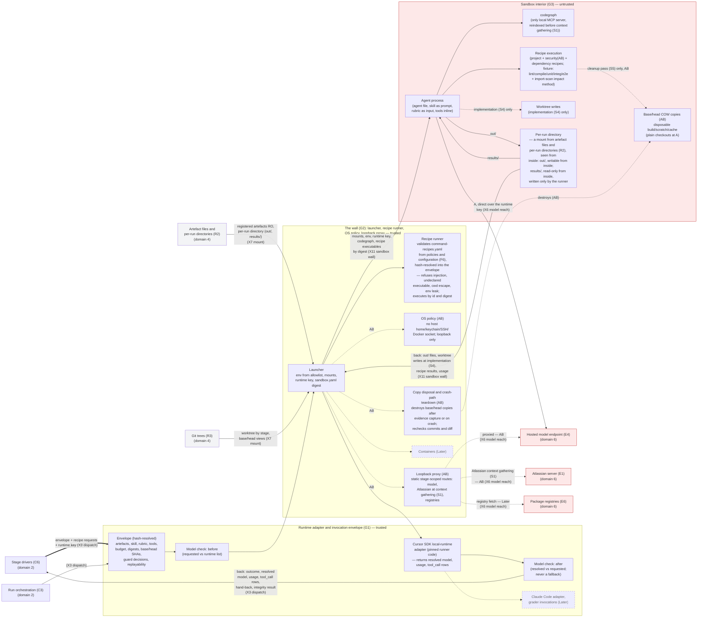
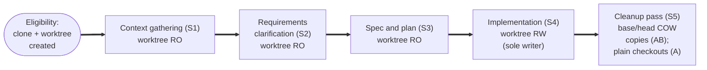
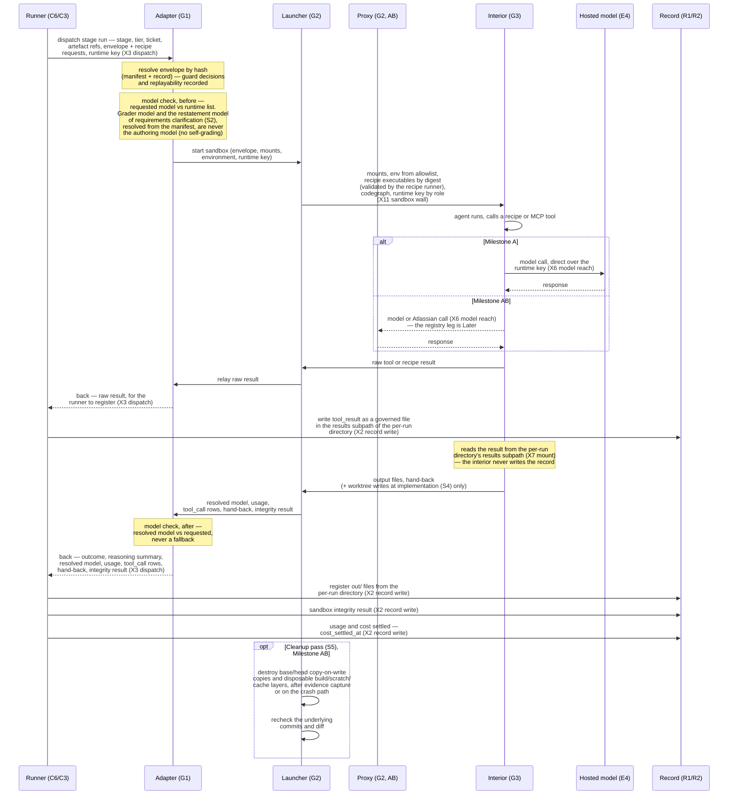

# L2 — Domain 3, Execution boundary

| Field | Value |
|---|---|
| Status | Draft v0.5 |
| Date | 2026-09-10 |
| Owner | Abhishek Thakur |
| Derived from | `docs/prd/prd.md` v0.18; `docs/design/milestones.md` v0.6; `docs/charter.md` v0.14 |
| Layer | 2 |
| Domain | 3, Execution boundary |
| Domain rule | The wall the runner builds around every agent or build run, and the untrusted interior. The runtime adapter and envelope (G1) and the wall (G2) are the wall — trusted runner code; the sandbox interior (G3) is the interior — untrusted. |

**Legend.** S0 intake; S1 context gathering; S2 requirements clarification; S3 spec and plan; S4 implementation; S5 cleanup pass; X2 record write; X3 dispatch; X4 tree read; X5 outside access; X6 model reach; X7 mount; X11 sandbox wall; C3 run orchestration; C5 guard; C6 stage drivers; C7 external access; C9 checks and gates; G1 runtime adapter and invocation envelope; G2 the wall; G3 sandbox interior; R1 SQLite ledger; R2 artefact files and per-run directories; R3 git trees; F1 tree and change control; F2 manifest; F3 agent definitions and skills; F6 policies, configuration and catalogue; E1 Atlassian server; E4 hosted model endpoint; E5 host credential store and scheduler; E6 package registries.

## How to read

Three diagrams. The first shows the three domain-3 components (the runtime adapter and envelope (G1), the wall (G2) — launcher, recipe runner, OS policy, loopback proxy, and the sandbox interior (G3)) as subgraphs with their parts as nodes, and the border stubs this file's own crossings name: the stage drivers (C6) and run orchestration (C3) over dispatch (X3); artefact files and per-run directories (R2) and git trees (R3) over mount (X7); the hosted model endpoint (E4), the Atlassian server (E1) and package registries (E6) over model reach (X6). The host credential store (E5) is not drawn: no crossing in the register runs domain 6 to domain 3 — the runtime key is fetched by external access (C7) over outside access (X5) in Control plane and arrives here already inside the dispatch (see "Not drawn"). Trust is stated per component in each subgraph's own title, not by shading the adapter and the wall, which are trusted like every other runner component. The second is a stage-by-stage view of what the wall does differently at each of context gathering (S1) to the cleanup pass (S5) (intake (S0) is scripts only, no worktree and no sandbox, so it is not a row here): a Markdown table (chosen over a flowchart because five columns times five stages reads as a grid, not a graph — a `flowchart` with five subgraphs and the same cells would need the same twenty-odd labelled nodes with far less legibility) plus one small diagram showing the worktree's mount regime changing stage by stage. The third is a `sequenceDiagram` for one invocation's lifecycle, from the stage driver's dispatch to the cleanup-pass disposal step.

A thick edge (`==>`) marks the main ticket path only: the dispatch (X3) of the stage drivers (C6) into `G1_envelope`. Every other edge — including every return leg, the mounts of the sandbox wall (X11), and both legs of model reach (X6) — is plain, matching `L1-bird-view.md` and `L2-external-systems.md`. Every dispatch and every mount (X7) crossing passes the guard (C5) and leaves one `guard_decision` row; the guard's seats are drawn once, in `L2-control-plane.md`, and are not redrawn here. Unmarked nodes and edges hold from Milestone A. `(AB)` marks a part or edge that first exists at the boundary-and-connection milestone; a dotted edge `-.->` carries only from AB unless its label says otherwise, and an AB part is joined to the trusted-A part it attaches to by one such dotted edge rather than chained to its AB siblings. `(Later)` with a dashed border marks a part no Initial row needs, joined to the part it grows from by one dotted edge, never a box on the main path. The untrusted sandbox interior (G3) is shaded red; the record's own border stubs, artefact files and per-run directories (R2) and git trees (R3), are shaded grey; the external border stubs, the hosted model endpoint (E4), the Atlassian server (E1) and package registries (E6), are shaded red, since their content is untrusted like the interior's. Left out on purpose: domain 2's stage-driver and check-block logic, domain 4's ledger tables, and domain 6's own internals — each is a border stub here, drawn in full in its own domain's L2 file.

## Diagram 1 — the three components and their border crossings

Shows the runtime adapter and envelope (G1) to the sandbox interior (G3) as subgraphs with their parts as nodes, and the border stubs of neighbouring domains: the stage drivers (C6) and run orchestration (C3) over dispatch (X3); artefact files and per-run directories (R2) and git trees (R3) over mount (X7); the hosted model endpoint (E4), the Atlassian server (E1) and package registries (E6) over model reach (X6).

## Diagram 2 — the wall, stage by stage

Chosen shape: a Markdown table for the five columns (mount, tools, credential, may-leave, never-crosses) across five stages, because that is twenty-five cells of mostly-prose content that a flowchart would have to render as twenty-five boxes with no extra structure to gain; a small `flowchart` beside it carries the one piece that genuinely is a graph — how the worktree's mount regime changes as the ticket moves through the stages. The tool-attachment table `08-configuration.md` cites is at lines 93 to 102 (header at 93–94, one row per stage at 95–102); every stage-table citation below points inside that range.

| Stage | Mounted, how | Tools/servers attached | Credential inside | May leave | Never crosses |
|---|---|---|---|---|---|
| Context gathering (S1) | Worktree, read-only (`08-configuration.md:111`) | Atlassian (read), codegraph, repository read (`08-configuration.md:96`) | Scoped runtime key | The brief, into the per-run directory's `out/` subpath; tool results only as the bounded path/excerpt of R-I-17 | Same as the shared list below |
| Requirements clarification (S2) | Worktree, read-only, per the attachment table's repository read (`08-configuration.md:97`) — named in the day-one paragraph (`08-configuration.md:111`), read-only as the attachment table says; `ticket_source` and `brief` artefacts as registered inputs | Repository read; no MCP server named | Scoped runtime key | Criteria and questions, into the per-run directory's `out/` subpath | Same as the shared list below |
| Spec and plan (S3) | Worktree, read-only (`08-configuration.md:111`) | codegraph, repository read (`08-configuration.md:98`) | Scoped runtime key | The plan, into the per-run directory's `out/` subpath | Same as the shared list below |
| Implementation (S4) | Worktree, read-write — implementation is its sole writer (R-I-3, R-I-11, `08-configuration.md:99,111`); other registered artefacts read-only | codegraph, repository read/write confined to the worktree, named typed recipes (`08-configuration.md:99`) | Scoped runtime key only, no usable push authority (R-I-11) | Output files and hand-back, **and** worktree writes — the only stage whose sandbox writes reach tracked source | Same as the shared list below |
| Cleanup pass (S5) | Separate clean base/head copy-on-write copies of the immutable checkouts (AB), isolated disposable build/scratch/cache each; plain base/head checkouts at A (R-I-14; `milestones.md:145,164`); destroyed after evidence capture or on the crash path, with a recheck of the underlying commits and diff (R-I-14) | None — no agent; named project recipes, plus security recipes (AB), inside a clean sandbox (`08-configuration.md:100`) | None — "no key of any kind enters a build sandbox" (R-I-14) | Check evidence only — never the ticket source or branch (`08-configuration.md:100`) | Also: never the ticket source or branch; no credential of any kind |

Every row's "Never crosses" cell reads "Same as the shared list below" because the exclusion is uniform: the record (`runs/factory.sqlite`), the tree (`factory/`), a push URL, any credential other than the one named for that stage, ambient environment, and any egress but loopback (from AB) never cross into any stage's sandbox (R-I-3, R-I-11, R-I-14); the cleanup pass (S5) alone adds the ticket source and branch to that list, noted in its own cell.

The worktree's mount regime changes once per stage transition, never mid-stage:

## Diagram 3 — one invocation's lifecycle

A `sequenceDiagram` for one task-attempt invocation, from the stage driver's dispatch to the cleanup-pass (S5) disposal step. The proxy leg (AB) is dotted throughout; every other message holds from A.

## Derivation table

| Component or part | `milestones.md` block | Requirement rows | First step |
|---|---|---|---|
| Runtime adapter and invocation envelope (G1) | Invocation and runtime adapter | R-I-4 (sec), R-I-13, R-I-15, R-I-17 | A |
| G1_envelope (envelope, hash-resolved; guard decisions, replayability) | Invocation and runtime adapter | R-I-15 | A |
| G1_checkpre / G1_checkpost (model checks) | Invocation and runtime adapter | R-I-4, R-I-13 | A |
| G1_adapter (Cursor SDK local-runtime adapter) | Invocation and runtime adapter | R-I-13, R-I-2 | A |
| `tool_call` row (not separately drawn; written by G1_adapter, table lives in the SQLite ledger (R1)) | Invocation and runtime adapter | R-I-13, R-I-17 | A |
| Governed tool-result files (not separately drawn; written by the runner — the stage drivers and run orchestration (C6, C3) in diagram 3 — held in the per-run directory of artefact files and per-run directories (R2), results subpath) | Invocation and runtime adapter | R-I-17 | A |
| Delivery through the stage-approved proxy into the results subpath of the per-run directory | Invocation and runtime adapter | R-I-17 | AB |
| Child invocations (restatements at requirements clarification (S2); not separately drawn — G1_adapter dispatches these through the same envelope mechanism) | Run (secondary: Manifest) | R-S2-3 | A |
| G1_later (Claude Code adapter, grader invocations) | Invocation and runtime adapter | — (Later, PRD section 10) | Later |
| The wall (G2) — launcher, recipe runner, OS policy, loopback proxy | Sandbox | R-I-14 | AB (thin form at A) |
| G2_launcher (launcher-built environment) | Sandbox | R-I-14, R-I-16 (sec) | A |
| G2_reciperunner (recipe runner: validator + execution by id and digest) | Recipe | R-I-16 | A |
| `command-recipes.yaml` (catalogue file; not drawn as a node — named in G2_reciperunner's label, hash-resolved into the envelope over the tree read (X4); home policies, configuration and catalogue (F6)) | Recipe (secondary: Factory tree and change control) | R-I-16 | A |
| G2_ospolicy (OS policy) | Sandbox | R-I-14, R-I-3 (sec), R-I-11 (sec) | AB |
| G2_proxy (loopback allowlisting proxy) | Sandbox | R-I-14, R-I-17 (sec) | AB |
| G2_disposal (copy disposal and crash-path teardown with recheck of the underlying commits and diff) | Sandbox | R-I-14 | AB |
| Escape suite (not separately drawn; a test suite over the wall (G2) and the sandbox interior (G3)) | Sandbox | R-I-14, R-F-14 (sec) | AB |
| G2_later (containers) | Sandbox | — (Later, PRD section 10) | Later |
| Sandbox interior (G3) | Sandbox | R-I-3, R-I-11, R-I-14 | AB (thin form at A) |
| G3_agent (agent process) | Sandbox | R-I-3 | A |
| G3_codegraph | Sandbox (secondary: Context index) | (named in R-I-14's text; no dedicated row) | A |
| G3_recipe (recipe execution) | Recipe (secondary: Sandbox) | R-I-16, R-S5-1 (sec), R-S5-2 (sec) | A (security recipes AB) |
| G3_rundir (per-run directory, `out/` and `results/` — a mount, seen from inside; home artefact files and per-run directories (R2)) | Artefact (secondary: Sandbox) | R-T-2, R-I-14 (sec), R-I-17 (sec) | A (row at AB in Appendix A: the isolation or results-subpath enforcement it names arrives with the OS policy; `results/` unwritable from inside at AB) |
| G3_s4write (worktree writes at implementation (S4) only) | Sandbox (secondary: Artefact) | R-S4-2, R-I-3, R-I-11 | A |
| G3_s5copies (base/head copy-on-write copies) | Sandbox | R-I-14, R-S5-1 (sec), R-S5-2 (sec) | AB (plain checkouts at A) |
| Stage drivers and run orchestration (C6, C3) (border stub, Control plane) | Run | R-S4-5, R-S4-9 | A |
| Artefact files and per-run directories (R2) (border stub, Record — registered artefacts, per-run directory) | Artefact | R-T-2 | A (`results/` unwritable from inside at AB) |
| Git trees (R3) (border stub, Record — worktree, base/head checkouts) | Git trees (row's block: Sandbox; drawn here as the part that carries it) | R-I-14 | A (COW views AB) |
| Hosted model endpoint (E4), Atlassian server (E1), package registries (E6) (border stub, External systems) | (external, per candidate domain list) | R-I-14 (route), R-S1-4 (Atlassian leg), R-S5-15 (registry leg, Later) | A for the hosted model direct; AB for the proxy leg and the Atlassian and registry legs |

## Not drawn

- Claude Code adapter and grader invocations (the runtime adapter and envelope (G1), Later; PRD section 10; drawn dashed as `G1_later` rather than omitted, per the register's own "Parts to show" for the adapter).
- Containers as the sandbox implementation (the wall (G2), Later; PRD section 10; drawn dashed as `G2_later`).
- The advisory tier's independent agent pass (R-S5-8, Later; owned by agent definitions and skills (F3), domain 5, see `L2-factory-as-code.md`) — it would run inside the sandbox interior (G3) like any other agent invocation, but no Initial row needs it, so no node names it.
- A GitHub or Slack credential inside any sandbox — the charter's anti-goal list forbids it outright; no node or edge represents it, and diagram 2's "never crosses" column states the exclusion explicitly for every stage.
- The sandbox writing the record or the tree — never drawn; the runtime adapter and envelope (G1), the wall (G2) and the sandbox interior (G3) have no edge into the SQLite ledger (R1) or tree and change control (F1). The adapter only hands results back over dispatch (X3); the trusted runner outside this domain — the stage drivers and run orchestration (C6, C3), the "Runner (C6/C3)" of diagram 3 and the border stub of diagram 1 — writes rows and registers files over the record write (X2), including the tool-result file into the results subpath of the per-run directory, which this domain only ever reads back as a mount (X7).
- A push URL inside any sandbox — R-I-3, R-I-11, and R-I-14 all state no stage in this domain has one; `pr_create`/`pr_update` (external access (C7), domain 2) is out of scope for this file.
- The guard (C5) — stated once in "How to read": dispatch (X3) and mount (X7) pass it and each leaves one `guard_decision` row, but the seat itself is drawn once, in `L2-control-plane.md`, not redrawn here.
- Domain 2's Check-block logic (the exclusion gate, the size gate of spec and plan (S3), structure/traceability checks, `risk_map`, `handoff_ready`, the preflight and ordered check list of the cleanup pass (S5), fix-round routing, the waiver check) — these run trusted-side, outside any sandbox, and belong to checks and gates (C9) in Control plane, dispatched one at a time by the stage drivers (C6); only the checks and recipes that actually execute *inside* the boundary (`G3_recipe`) are drawn here.
- The recipes component (G4) of v0.1, the fourth domain-3 component — folded: the catalogue validator and execution by id and digest are now `G2_reciperunner`; recipe execution stays `G3_recipe`; the catalogue file `command-recipes.yaml` lives in policies, configuration and catalogue (F6) and is named in `G2_reciperunner`'s label rather than drawn as a border stub, since the representative carrier of the tree read (X4) is the manifest (F2), not the policy and catalogue files.
- A direct edge from the host credential store (E5) into this domain — never drawn; no crossing in the register runs domain 6 to domain 3. The runtime key travels outside access (X5), from the credential store to external access (C7) in Control plane, then dispatch (X3), from the stage drivers and run orchestration (C6, C3) to the runtime adapter and envelope (G1) inside the dispatch envelope, then the sandbox wall (X11), from the launcher of the wall (G2) to the agent sandbox only.
