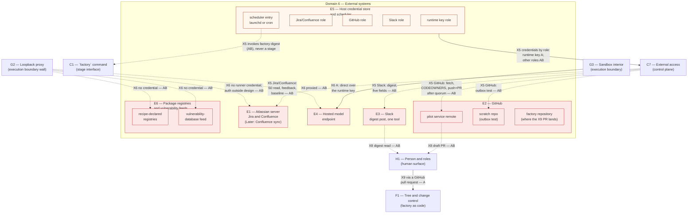

# L2 — External systems (domain 6)

| | |
|---|---|
| Status | Draft v0.3 |
| Date | 2026-09-07 |
| Owner | Abhishek Thakur |
| Derived from | `docs/prd/prd.md` v0.18; `docs/design/milestones.md` v0.6; `docs/charter.md` v0.14 |
| Layer | 2 |
| Domain | 6, External systems |
| Domain rule | A component sits in the domain where its code runs or its file lives, and under whose trust it acts. Domain 6, External systems, is everything outside the engineer's machine, plus the two host facilities the runner trusts: the credential store and the scheduler. Trust (README §2): content untrusted; the credential store and scheduler are trusted host facilities. |

## How to read

The first diagram is the domain picture: E1 to E6, split into their several faces where one system plays more than one role (GitHub's three repositories; the credential store's five roles), each labelled with what it is used for and from which step. The crossings that reach domain 6 are drawn from border stub nodes — C1 (the `factory` command), C7 (external access), G2 (the loopback proxy), G3 (the sandbox interior), H1 (the person), F1 (tree and change control) — carrying the same ids they hold in the control-plane, execution-boundary, human-surface and factory-as-code files; nothing about those components is redrawn here beyond the one label needed to anchor the edge. The second diagram follows each credential role on its own: where the host credential store hands it out, which trust-profile route authorises it, the step it first works at, and what it may never do. Unmarked labels hold from Milestone A; a step written after a label (`AB`, `B`, `Later`) marks when that fact starts being true, and a dotted edge (`-.->`) carries every crossing that only holds from AB, B or Later — nearly every edge into a real outside system, since Milestone A runs on local fixtures and stub deliverers. A thick edge marks the main ticket path only; nothing in this domain sits on that path, so no edge here is thick. Every crossing edge in these diagrams passes the guard (C5) and leaves one `guard_decision` row; C5's seats are drawn once, in `L2-control-plane.md`, and are not redrawn here.

Every domain-6 node except E5 is shaded red, the untrusted-content class, because everything else this domain returns is content the guard must classify before it is trusted. E5 (the credential store and scheduler) is shaded a distinct, unmarked colour instead: the domain rule above states the exception by name, so E5 is drawn as a trusted host facility, not as untrusted content.

The runtime key's path is one route across both diagrams: the runner fetches it, with every other credential, by role from E5 over X5, landing on C7 — never on the sandbox or the launcher directly, since no crossing in the register runs domain 6 to domain 3. From there the key travels inside the control plane and the execution boundary, not across a domain-6 border: C6/C3 hand it to the launcher inside the dispatch envelope (X3), and the launcher supplies it to the agent sandbox alone across the wall (X11). Neither X3 nor X11 touches this domain, so that hand-off is stated here as a note, not drawn as an edge; no other credential ever reaches a sandbox by any route. What domain 6 does draw is the key's use once it is inside: G3 reaching the hosted model directly at Milestone A, and, from AB, the proxy in front of it — both on X6, which does cross into this domain.

Left out on purpose: how each outside system authenticates internally (Jira/Confluence's own auth is "outside this design by owner decision," Appendix B X6); the git-tree mechanics of the pinned checkout itself (clone, worktree, `base_sha`), which belong to the record and control-plane files; and the trust profile's own class-and-route policy content, which belongs to the factory-as-code file. Grafana, OpenSearch, AWS and LaunchDarkly are not drawn at all — the charter places them out of scope for the factory, not merely Later (see Not drawn).

The first diagram shows the six external systems, their several faces, and every crossing that reaches them.

The second diagram follows each credential role from the host credential store to its authorising trust-profile route, its first step, and what it can never do. It draws the credential fetch (X5) into C7 and the runtime key's eventual use (X6) out of G3 and G2 as two separate edges, with nothing joining them: the hand-off between the two, through the dispatch and the wall, is a control-plane and execution-boundary fact, stated below as a note rather than drawn.

```mermaid
flowchart TB
  E5_runtime["E5 — runtime key role"]
  E5_atlassian["E5 — Jira/Confluence role"]
  E5_github["E5 — GitHub role"]
  E5_slack["E5 — Slack role"]
  E5_sched["E5 — scheduler entry"]

  C7["C7 — External access<br/>(the runner, control plane)"]
  C1["C1 — `factory` command<br/>(stage interface)"]
  G3["G3 — Sandbox interior<br/>(execution boundary)"]
  G2["G2 — Loopback proxy<br/>(execution boundary wall)"]

  E4["E4 — Hosted model endpoint"]
  E1["E1 — Atlassian server"]
  E2_pilot["E2 — GitHub<br/>pilot + scratch"]
  E3["E3 — Slack"]
  E6["E6 — Registries and<br/>vulnerability feed"]

  E5_runtime -->|"X5 runtime key, A"| C7
  E5_atlassian -.->|"X5, AB"| C7
  E5_github -.->|"X5, AB"| C7
  E5_slack -.->|"X5, AB"| C7

  C7 -.->|"X5 Atlassian: S0 read,<br/>feedback, baseline — AB"| E1
  C7 -.->|"never"| N2["Never: write beyond one<br/>idempotent Jira feedback;<br/>enter a sandbox"]

  C7 -.->|"X5 GitHub role:<br/>S6 after quorum, plus S0<br/>and S5 reads — AB"| E2_pilot
  C7 -.->|"never"| N3["Never: push before quorum;<br/>any ref but ticket branch;<br/>merge, approve, rerun<br/>Actions; enter a sandbox"]

  C7 -.->|"X5 Slack role:<br/>digest command — AB"| E3
  C7 -.->|"never"| N4["Never: post anything but<br/>the digest; enter a sandbox"]

  E5_sched -.->|"X5 invokes factory digest<br/>(AB), never a stage"| C1
  C1 -.->|"never"| N6["Never: start a stage or<br/>an agent invocation"]

  G3 -->|"X6 A: direct over<br/>the runtime key"| E4
  G2 -.->|"X6 proxied — AB"| E4
  G3 -.->|"never"| N1["Never: outside the proxy<br/>route; a fallback model;<br/>a build sandbox"]

  G2 -.->|"X6 S1 context gathering,<br/>no runner credential — AB"| E1

  G2 -.->|"X6 registry + vuln feed,<br/>credential none — AB"| E6
  G2 -.->|"never"| N5["Never: an endpoint outside<br/>the recipe-declared allowlist"]

  classDef untrusted fill:#fde8e8,stroke:#b91c1c
  class E4,E1,E2_pilot,E3,E6 untrusted
```

The runtime key's onward path, once C7 has fetched it: the control plane hands it to the launcher inside the dispatch envelope over X3, and the launcher alone supplies it to an agent sandbox over the wall, X11 — neither crossing touches domain 6, so neither is drawn above. No credential but the runtime key ever reaches a sandbox by any route; the Atlassian, GitHub and Slack roles stop at C7.

## Derivation table

| Component or part | `milestones.md` block | Requirement rows | First step |
|---|---|---|---|
| E1 — Atlassian server (Jira, Confluence) | External access | R-S0-1, R-S1-4, R-H-10, R-O-6 | AB (Later: R-H-10 Confluence sync) |
| E2 — GitHub | External access | R-T-11, R-S6-3, R-S7-1, R-S7-2, R-S7-6 | AB (Later: R-S7-1, R-S7-2, R-S7-6) |
| E2_pilot — pilot service remote | External access | R-S6-3, R-S6-6, R-O-6 | AB (R-S6-6's reviewer-set read itself is A, against the fixture repo) |
| E2_scratch — scratch repository (outbox test) | External access | R-T-11, R-S6-3 | AB |
| E2_factory — factory repository | External access (secondary: factory tree and change control) | R-F-4, R-F-9 | A (R-F-4 adoption path; R-F-9 branch protection Later; R-F-14's fixture gate is drawn in `L2-factory-as-code.md`, block Fixtures and evals) |
| E3 — Slack | External access | R-H-3 | AB |
| E4 — Hosted model endpoint | Invocation and runtime adapter | R-I-13, R-I-4 | A |
| E5 — Host credential store and scheduler | External access (secondary: Sandbox, R-I-14, via E5_runtime) | R-H-3 | A for the runtime key; AB for the rest |
| E5_runtime — runtime key role | Sandbox | R-I-14 | A (row completes AB; the key itself is in the Sandbox block's A shape) |
| E5_atlassian — Jira/Confluence role | External access | R-S0-1, R-S1-4 | AB |
| E5_github — GitHub role | External access | R-S6-3 | AB |
| E5_slack — Slack role | External access | R-H-3 | AB |
| E5_sched — scheduler entry (launchd/cron) | External access | R-H-3 | AB |
| E6 — Registries and vulnerability feed | Check (secondary: Sandbox) | R-S5-1, R-S5-2 (Check rows, secondary sandbox, that need the registry and vulnerability-feed routes) | AB (fixture project vendors dependencies at A, no registry route) |
| E6_reg — recipe-declared registries | Recipe (secondary: Check, R-S5-2) | R-I-16 (Recipe row for the declared allowlist); R-S5-2 (Check row, secondary sandbox, that needs this route) | AB |
| E6_vuln — vulnerability-database feed | Recipe (secondary: Check, R-S5-1) | R-S5-1 (Check row, secondary sandbox, that needs this route) | AB |

Note on R-I-14: it is the requirement row that fixes the runtime key's route end to end — fetched from E5 over X5, dispatched over X3, supplied to the sandbox over X11, used on X6 — so it recurs against E5_runtime, G3 and G2 rather than sitting once.

## Not drawn

- **Grafana, OpenSearch, AWS, LaunchDarkly** — named in the charter's own section 7 environment table (charter.md:177–181) but excluded from the brief's component register entirely. The charter marks Grafana "not an agent tool," OpenSearch and LaunchDarkly "out of scope," and AWS "None for pilot" (D9, D25); the crossings table's unlabelled row states directly: "Rollout/flag-ramp/production-verification: nothing crosses into the factory... out of scope (not Later)." None of the six E-nodes' Initial rows need them, so nothing is missing by their absence.
- **Confluence sync, GitHub's S7 reads** (`R-H-10`, `R-S7-1`, `R-S7-2`, `R-S7-6`, all Later) — their block, External access, is homed at C7, domain 2; owned by `L2-control-plane.md`, not restated here.
- **The maintenance scan's own external read** (`R-S0-9`, Later) — its block, Skill, is homed at F3, domain 5; owned by `L2-factory-as-code.md`, not restated here.
- **The observer pass's grader-model call** (`R-O-10`, Later) — its block, Fixtures and evals, is homed at F8, domain 5; owned by `L2-factory-as-code.md`, not restated here.
- **Codegraph** — third-party software, but it runs inside the sandbox interior (G3) on the local worktree; it is not an external system, so it is correctly absent from this file.
- **A push before quorum, an agent holding a GitHub or Slack credential, the scheduler starting a stage, an approval carried past a change** — charter anti-goals and R-I-11's forbidden-capability set; none of the six charter anti-goal exclusions on autonomous merge or deploy appear on either diagram.
- **X6's permanent route to the hosted model is charter-admitted** since charter v0.14: C10 admits, for an agent sandbox only, the approved hosted-inference endpoint reached through the loopback proxy with the scoped, spend-capped runtime key, and a build sandbox holds no key of any kind. Both diagrams draw that route; `findings.md` section 1, item 3 records the amendment.
