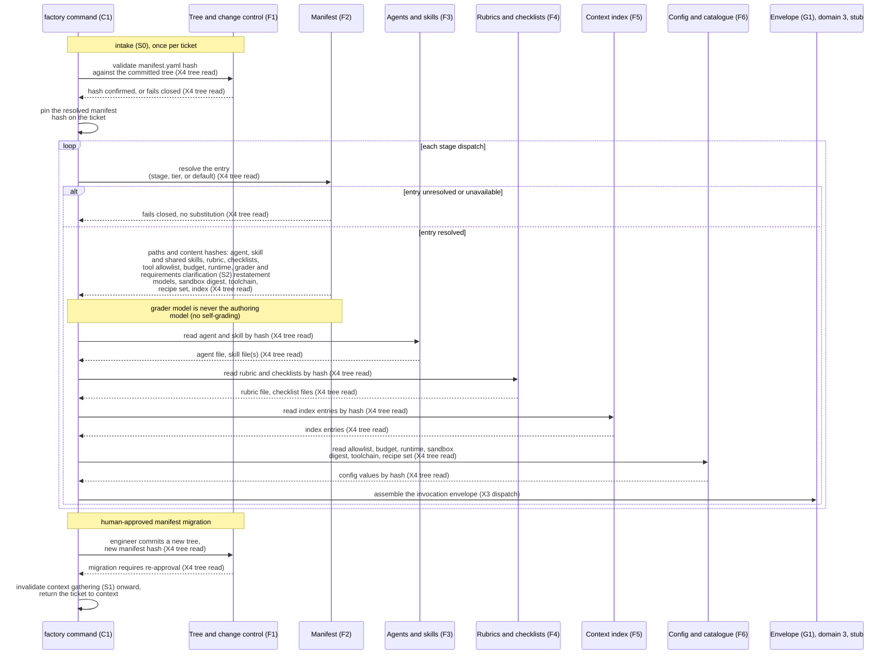
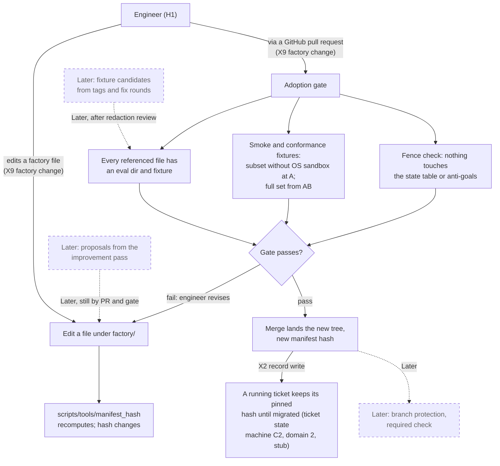

# L2 — Domain 5, Factory as code

| | |
|---|---|
| Status | Draft v0.5 |
| Date | 2026-09-10 |
| Owner | Abhishek Thakur |
| Derived from | `docs/prd/prd.md` v0.18; `docs/design/milestones.md` v0.6; `docs/charter.md` v0.14 |
| Layer | 2 |
| Domain | 5, Factory as code |
| Domain rule | Versioned content under `factory/`, read-only at run time, every file hashed by the manifest. |

**Legend.** S0 intake; S1 context gathering; S2 requirements clarification; S3 spec and plan; S4 implementation; S5 cleanup pass; S6 human review; X2 record write; X3 dispatch; X4 tree read; X9 factory change; X10 findings return; H1 person and roles; C1 `factory` command; C2 ticket state machine and the fence; C5 guard; C7 external access; C9 checks and gates; G1 runtime adapter and invocation envelope; G2 the wall (launcher, recipe runner, OS policy, loopback proxy); G4 the withdrawn recipes component, folded into G2 and F6; R1 SQLite ledger; R2 artefact files and per-run directories; R3 git trees; R5 measure views and baseline; F1 tree and change control; F2 manifest; F3 agent definitions and skills; F4 rubrics and checklists; F5 context index; F6 policies, configuration and catalogue; F7 scripts; F8 fixtures and evals.

## How to read

Three diagrams. The first is the domain diagram: the eight components of domain 5, tree and change control (F1) through fixtures and evals (F8), as subgraphs, PRD section 7's directory tree drawn as nodes inside the component that owns each directory, the edges inside the domain, and the border crossings tree read (X4), factory change (X9) and findings return (X10) drawn to stub nodes for the other domains that carry them: the tree read reaches the `factory` command (C1) for manifest resolution and checks and gates (C9) for the policy files the manifest hashes (waiver policy, security checks); the factory change reaches tree and change control from the human surface, the person and roles (H1); the findings return reaches fixtures and evals from the record's export directory, the artefact files (R2) — none of the stub nodes' internals are drawn here; see the domain-1, domain-2 and domain-4 Layer 2 files. The second is the run-time resolution walk: how the runner turns a manifest entry into an invocation envelope at intake (S0) and at every stage dispatch, as a sequence diagram. The third is a change landing: the engineer's own pull request against `factory/` from edit to merge, and what a running ticket keeps until it migrates.

Marks: unmarked parts hold from Milestone A. A dashed node or a dotted edge marked `AB` holds only once the OS policy, copy-on-write copies and loopback proxy exist; marked `B` holds only once the pilot ticket export lands; marked `Later` is designed but not built in the initial version. A thick edge is not used in these diagrams — none of the three shows the main ticket path, which belongs to the domain-1/2 sequence diagram. Every crossing edge in these diagrams passes the guard (C5) and leaves one `guard_decision` row; the guard's seats are drawn once, in `L2-control-plane.md`, and are not redrawn here.

Left out on purpose: the internals of Checks and gates (C9), Guard (C5) and the outbox worker (C7), which read this domain's files but are drawn in the control-plane Layer 2 file; the calibration, holdout, benchmark and improvement-pass mechanics, which are named only as Later labels; and `runs/`, which the PRD's tree diagram shows beside `factory/` but which is explicitly outside version control and belongs to domain 4 (Record).

## Diagram 1 — the domain

What it shows: tree and change control (F1) through fixtures and evals (F8) as subgraphs, PRD section 7's tree as nodes under the component that owns each directory or named file group, the edges inside the domain, and the three border crossings whose carrier sits in this domain (the tree read (X4) out to the control plane — the `factory` command (C1) for resolution, checks and gates (C9) for the waiver policy and its non-waivable list — the factory change (X9) in from the human surface via GitHub, the findings return (X10) in from the record's export directory, the artefact files (R2), dotted, holding only from B).

```mermaid
flowchart TB
    subgraph F1["Tree and change control (F1)"]
        F1_lints["lints/<br/>outside the blocking tier"]
        F1_gate["Adoption gate"]
        F1_later["Later: branch protection,<br/>proposal pull requests"]
    end

    subgraph F2["Manifest (F2)"]
        F2_manifest["manifest.yaml<br/>stage x tier, default entry:<br/>runtime, grader and requirements<br/>clarification (S2) restatement models<br/>(grader ≠ authoring model,<br/>no self-grading)"]
        F2_migration["Migration:<br/>re-approval, fails closed"]
        F2_ab["AB: capability enforcement<br/>needs OS policy"]
    end

    subgraph F3["Agent definitions and skills (F3)"]
        F3_agents["agents/<br/>context gathering (S1) to<br/>implementation (S4)"]
        F3_skills["skills/<br/>one per agent stage"]
        F3_shared["skills/shared/<br/>attached by manifest entry"]
        F3_later["Later: advisory/grader agents,<br/>per-tier and path-scoped files,<br/>enrolled maintenance skills"]
    end

    subgraph F4["Rubrics and checklists (F4)"]
        F4_rubrics["rubrics/<br/>intake.md to human_review.md, generated"]
        F4_checklists["rubrics/checklists/<br/>forced-categories, send-back-grounds,<br/>split-patterns, comment-rules, test-filter"]
        F4_bootstrap["Bootstrap checklist<br/>human verdicts at<br/>spec and plan (S3)"]
        F4_later["Later: grader authority<br/>(advisory, then blocking<br/>after calibration)"]
    end

    subgraph F5["Context index (F5)"]
        F5_index["index/<br/>entries with front matter,<br/>kind incl. caller"]
        F5_ab["AB: pilot service's<br/>conventions and sensitive<br/>paths (two entries), plus<br/>caller entries where known"]
        F5_refresh["Later: incremental<br/>re-index"]
    end

    subgraph F6["Policies, configuration and catalogue (F6)"]
        F6_policy["Policy files<br/>trust-profile, owners, waiver-policy,<br/>incident-policy, sensitive-paths,<br/>security-checks (AB), sandbox,<br/>runtime"]
        F6_recipe["command-recipes.yaml<br/>Recipe catalogue, validated and<br/>run by the wall (G2), which absorbed<br/>the withdrawn recipes component (G4);<br/>project.yaml"]
        F6_tuning["Tuning files<br/>tiers, limits, ticket-types,<br/>service-tiers, artifact-to-service,<br/>pricing"]
        F6_catalogue["catalogue/<br/>failure-modes, decisions"]
        F6_later["Later: maintenance.yaml"]
    end

    subgraph F7["Scripts (F7)"]
        F7_check["scripts/checks/<br/>size_gate, scope_diff,<br/>source_declaration_diff,<br/>behavior_contract_evidence,<br/>dep_verify, security_checks,<br/>base_test_diff, risk_map,<br/>handoff_ready, impact_scan"]
        F7_util["scripts/tools/<br/>archaeology, index_staleness,<br/>packet_assemble, pr_body_assemble,<br/>pr_create, pr_update, digest,<br/>export, import, purge, reindex,<br/>manifest_hash, rubric_gen, report,<br/>baseline_import, fixture_from_export"]
        F7_later["Later: pr_checks"]
    end

    subgraph F8["Fixtures and evals (F8)"]
        F8_evals["evals/<br/>one directory per referenced file"]
        F8_seed["Fixture project seed,<br/>committed under factory/evals/;<br/>materialised by the runner at setup:<br/>read by the tree read (X4), written<br/>under the pinned-source path<br/>by the record write (X2)"]
        F8_ab["AB: escape, copy-disposal,<br/>incident/control fixtures"]
        F8_later["Later: benchmarks/,<br/>grader authority (advisory,<br/>then blocking after calibration)"]
    end

    C1["factory command (C1)<br/>(control plane, stub)"]
    C9["Checks and gates (C9)<br/>(control plane, stub)"]
    H1["Engineer (H1)<br/>(human surface, stub)"]
    R2["Artefact files, export<br/>directory (R2)<br/>(record, stub)"]

    F2_manifest -->|"references every file by hash"| F1
    F2_manifest --> F3 & F4 & F5 & F6 & F7 & F8
    F7_util -->|"rubric_gen generates<br/>rubrics from rows"| F4_rubrics
    F1_gate -->|"calls"| F7_util
    F1_gate -->|"runs the fixtures<br/>on every change"| F8_evals
    F6_policy -->|"waiver-policy.yaml,<br/>non-waivable list<br/>(X4 tree read)"| C9
    F2_manifest -->|"read by hash at run time<br/>(X4 tree read)"| C1
    H1 -->|"via a GitHub pull request<br/>(X9 factory change)"| F1
    R2 -.->|"by the engineer's reviewed<br/>pull request (B)<br/>(X10 findings return)"| F8_evals

    F1_gate -.-> F1_later
    F2_manifest -.-> F2_ab
    F3_agents -.-> F3_later
    F3_skills -.-> F3_later
    F4_rubrics -.-> F4_later
    F5_index -.-> F5_ab
    F5_index -.-> F5_refresh
    F6_policy -.-> F6_later
    F7_util -.-> F7_later
    F8_evals -.-> F8_ab
    F8_evals -.-> F8_later

    classDef later stroke-dasharray:5 5,color:#666
    classDef content fill:#eef6ff
    class F1_later,F2_ab,F3_later,F4_later,F5_ab,F5_refresh,F6_later,F7_later,F8_ab,F8_later later
    class F2_manifest,F3_agents,F3_skills,F3_shared,F4_rubrics,F4_checklists,F4_bootstrap,F5_index,F6_policy,F6_recipe,F6_tuning,F6_catalogue,F7_check,F7_util,F8_evals,F8_seed content
```

## Diagram 2 — run-time resolution

What it shows: how the trusted runner's `factory` command (C1) turns a manifest entry into the reconstructable invocation envelope, once at intake (S0) for the whole ticket and once per stage dispatch, and the two ways resolution fails closed: an unresolved entry, or a migration to a new hash.

## Diagram 3 — a change landing

What it shows: the engineer's own pull request against `factory/`, from the edit to the merge, the adoption gate's three checks, and what a ticket already running keeps until it is migrated. The Later dotted edges show where branch protection, improvement-pass proposals and fixture candidates would enter the same path once built.

## Derivation table

| Component or part | `milestones.md` block | Requirement rows | First step |
|---|---|---|---|
| F1 Tree and change control (the `factory/` layout) | Factory tree and change control | R-F-1 | A |
| `scripts/tools/manifest_hash` (drawn once under scripts (F7), called by the adoption gate of tree and change control (F1)) | Factory tree and change control | R-F-1 | A |
| `lints/` | Factory tree and change control | R-F-1 (Appendix A secondary: manifest); the lint exclusion is R-S5-10's | A |
| Adoption gate, mechanics and fence check | Factory tree and change control | R-F-4, R-F-5, R-F-11 | A |
| Adoption gate, sandbox-dependent fixtures | Fixtures and evals | R-F-14 | AB |
| Branch protection | Factory tree and change control | R-F-9 | Later |
| F2 `manifest.yaml`, incl. grader model and requirements-clarification restatement model (never the authoring model) | Manifest | R-F-1, R-F-4, R-I-4, R-S2-3; charter commitment C6 (no self-grading) | A |
| Manifest migration | Manifest | R-I-4 | A |
| Manifest and sandbox capability enforcement (OS-policy dependent) | Manifest (secondary: Sandbox) | R-I-3, R-I-11, R-I-14 | AB |
| Agent process execution confined to declared recipe programs; the manifest's tool list passed into the runtime | Sandbox (secondary: Manifest) | R-I-18 | Later |
| F3 `agents/` | Agent definition | R-F-7 | A |
| F3 `skills/` | Agent definition (secondary: Skill) | R-F-7 | A |
| F3 `skills/shared/` | Agent definition (secondary: Skill) | R-F-7 | A |
| Advisory/grader agents, per-tier and path-scoped files | Agent definition | R-F-7 (clause), R-S5-8 | Later |
| Enrolled maintenance skill | Skill | R-S0-9 | Later |
| F4 `rubrics/` | Rubric (R-S0-6's block is ticket and its state; only its rubric line lives here) | R-S0-6, R-S1-2, R-S1-3, R-S1-6, R-S2-1, R-S2-2, R-S2-4, R-S2-10, R-S3-2, R-S3-3, R-S3-4, R-S3-5, R-S3-6, R-S3-7, R-S3-9, R-S3-10, R-S3-11, R-S3-20 | A |
| F4 `rubrics/checklists/` (forced-categories, split-patterns) | Rubric (secondary: Question and assumption log) | R-S2-4, R-S2-10 | A |
| Bootstrap checklist (human verdicts at S3) | Rubric (secondary: Binding) | R-S3-20 | A |
| Grader lines after calibration (grader authority extension point) | Rubric | R-S4-7 | Later |
| F5 `index/` | Context index | R-S1-7, R-F-6 | A |
| Pilot service's index entries (two, plus caller entries where known) | Context index | (block growth at AB; no dedicated AB row) | AB |
| Incremental re-index (index refresh extension point) | Context index | (`milestones.md:89`, extension points table) | Later |
| F6 `config/trust-profile.yaml` | Trust profile | R-T-9 | A |
| F6 `config/owners.yaml` | Approval and quorum (secondary: Trust profile) | R-F-13 | A |
| Tool attachment table, carried by `manifest.yaml`'s per-stage `tool_allowlist`; no `config/tools.yaml` (PRD decision 55) | Manifest (secondary: Sandbox) | R-I-3, R-I-4 | A / AB (allowlist resolved and recorded from A; see the "Manifest capability enforcement" row above) |
| F6 `config/sandbox.yaml` | Sandbox | R-I-14 | A / AB (digest and thin contract read from A; OS-policy enforcement AB) |
| F6 `config/runtime.yaml` | Invocation and runtime adapter (secondary: Sandbox) | R-I-13, R-I-14 | A / AB |
| F6 `config/pricing.yaml` | Invocation and runtime adapter | R-I-13 | A |
| F6 `config/command-recipes.yaml`, the Recipe block's catalogue file (the runner of recipes is the wall (G2); the recipes component (G4) is folded away) | Recipe | R-I-16 | A |
| F6 `config/security-checks.yaml` | Check | (08-configuration.md:89,106; register F6) | AB |
| F6 `config/project.yaml` | Git trees | (08-configuration.md:23,61,111) | A |
| F6 `config/service-tiers.yaml` | Ticket and its state | R-S0-2 | A |
| F6 `config/sensitive-paths.yaml` | Ticket and its state (secondary: Approval and quorum) | R-S0-5 | A |
| F6 `config/artifact-to-service.yaml` | Rubric (secondary: Check) | R-S1-3 | A |
| F6 `config/waiver-policy.yaml`, read by the waiver check of checks and gates (C9) (the non-waivable list lives here, not hard-coded in the gate) | Approval and quorum (secondary: Binding) | R-S5-13 | A |
| F6 `config/incident-policy.yaml` | Record | (08-configuration.md:106; `02-2-entities.md:149`) | A |
| F6 `config/tiers.yaml`, `ticket-types.yaml` | Ticket and its state | R-S0-2 | A |
| F6 `config/tiers.yaml` (budgets) | Manifest (secondary: Invocation and runtime adapter) | R-I-4 | A |
| F6 `config/limits.yaml` | Ticket and its state (secondary: Approval and quorum) | R-I-10; also `08-configuration.md` section 8 for the file's other constants | A (R-I-10's capacity increase gated at B) |
| F6 `config/project.yaml` (digest key) | External access (secondary: Queue item and decision) | R-H-3 | AB |
| F6 `config/maintenance.yaml` | Skill | R-S0-9 | Later |
| F6 `catalogue/` | Factory tree and change control (secondary: Tag) | R-F-1 | A |
| F7 `scripts/checks/` group | Check, Rubric, Artefact (secondary; F7 owns no `milestones.md` block of its own) | secondary attachments across the intake (S0) to cleanup-pass (S5) rows | A |
| F7 `scripts/tools/` group (incl. `manifest_hash`, see its own row above) | External access, Record, Rubric (secondary; same caveat) | secondary attachments; `pr_create`/`pr_update`/`digest` real from AB | A stub deliverers, AB real |
| F7 `scripts/tools/pr_checks` | External access | (Later, named in PRD tree only) | Later |
| F8 `evals/` | Fixtures and evals | R-F-2 | A |
| Fixture project seed | Fixtures and evals | decision 2 (`milestones.md:207`) | A |
| Escape, copy-disposal, incident/control fixtures | Fixtures and evals | R-F-14 | AB |
| F8 `benchmarks/` | Fixtures and evals | R-F-12 | Later |
| First governed real-ticket fixture | Fixtures and evals | R-F-2, R-T-4 | B |
| Improvement-pass proposals | Fixtures and evals (secondary: Factory tree) | R-F-10 | Later |
| Fixture candidates | Fixtures and evals (secondary: Tag) | R-F-15 | Later |
| Grader calibration, holdout harness, benchmark harness (grader authority extension point) | Fixtures and evals | R-F-3, R-F-8, R-F-12 | Later |

## Not drawn

- `runs/` — outside version control, out of this domain; it belongs to the Record domain: the SQLite ledger (R1), the artefact files (R2), the git trees (R3). PRD section 7 shows it beside `factory/` in one tree diagram, but R-F-1 excludes it from the manifest hash.
- Branch protection making the adoption gate a required GitHub check — R-F-9, Later; drawn as a dashed label only.
- The improvement pass reading `score`, `tag`, `human_signal` and `index_use` rows and drafting a proposal — R-F-10, Later; only the proposal's entry point onto the change-landing path is drawn.
- The benchmark harness's manifest-configuration matrix and the `benchmark` row schema — R-F-12, Later.
- The Later quality harness, holdout set and calibrated-grader mechanics — R-F-3, R-F-8, Later; the grader-authority extension point itself (advisory until calibrated, then blocking, `milestones.md:90`) is drawn as a dashed part of rubrics and checklists (F4) and fixtures and evals (F8), but the harness that produces a calibrated grader is not.
- Grader Markdown files' internal shape (label set, passing score, sampling rate, grader model) — named at `milestones.md:207` as fixed now so Later work starts from an existing file, but not built at A; not drawn.
- The observer pass and its scoring — R-O-10, R-O-11, Later; belongs primarily to Fixtures and evals but is not a factory-as-code content block itself.
- Dashboards over the record's views — Later, named under measure views and baseline (R5), not this domain.
- Containers as the execution boundary, and the Claude Code adapter — Later parts of domain 3, not drawn here.
- A no-discovery-layer, no-registry, no-gateway MCP process — excluded by the charter's own constraint (`milestones.md:25`), never drawn as a component.
- Anything writing `factory/` at run time — excluded by R-F-5; the only inbound edges to this domain in diagram 1 are the factory change (X9), the engineer's own pull request, and the findings return (X10), the one governed export at B, dotted.
- The charter's two deadlines for smoke and conformance evals agree since charter v0.14: commitment C6 says "before the first production-capable pilot ticket" and decision D41 now says the same. This diagram draws that reading (`F8_smoke`: the full fixture set from AB, before any real ticket passes context gathering (S1)); `findings.md` section 1, item 2 records the alignment.
