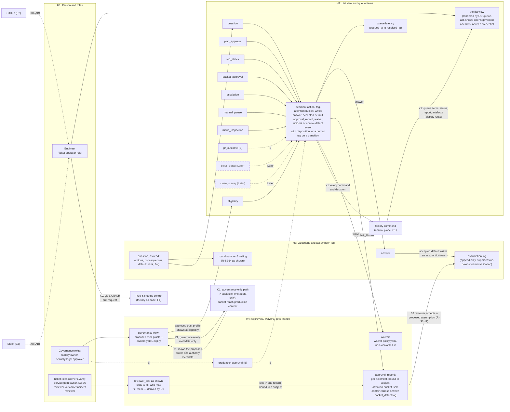

# Layer 2, Domain 1: Human surface

| | |
|---|---|
| Status | Draft v0.3 |
| Date | 2026-09-07 |
| Owner | Abhishek Thakur |
| Derived from | `docs/prd/prd.md` v0.18; `docs/design/milestones.md` v0.6; `docs/charter.md` v0.14 |
| Layer | 2 |
| Domain | 1, Human surface |
| Domain rule | A component sits in the domain where its code runs or its file lives, and under whose trust it acts. Human surface: what the person sees and does. Trusted. |

## How to read

Two diagrams. The first is the domain diagram: components H1 to H4 as subgraphs, each holding its parts as nodes, the edges among those parts inside the domain, and the crossings at its border. There is one X1 edge out of `H2` (from its decision) to `C1`, carrying every command and decision; one X1 edge back from `C1` to `H2` (to its rendered view), carrying queue items, status, the report and governed artefacts under the display route; and a second, distinct X1 path, metadata-only, from `H4`'s governance view into `C1`'s governance-only audit sink, which cannot reach production content. `X8` comes in from GitHub and Slack (`E2`, `E3`); `X9` goes out from the person to the factory tree (`F1`). `C1`, `C1_gov_audit`, `E2`, `E3` and `F1` are stub nodes: they are defined in their own domain's Layer 2 file (`L2-control-plane.md`, `L2-external-systems.md`, `L2-factory-as-code.md`) and appear here only as the far end of a crossing. The second diagram is a touchpoint strip over the states of PRD 2.3, not the transition graph: the complete transition table, every state and every transition including the mechanical ones no human takes, is drawn once, in `L2-control-plane.md`'s `C2` diagram.

Every X1 edge passes the guard (`C5`) and leaves one `guard_decision` row; the guard's seats are drawn once, in `L2-control-plane.md`, and are not redrawn here.

**Marks.** Unmarked parts and edges exist from Milestone A. `(AB)` marks what `milestones.md` section 3 builds between Milestone A and Milestone B; here it marks only `X8`, since the GitHub and Slack reads the person sees go live in that step. `(B)` marks the `pr_outcome` item's actions (revision, outcome, exposure, coverage) and the graduation approval; a dotted edge `-.->` carries the `(B)` label on the specific edges that hold only from Milestone B. `(Later)` marks `bloat_signal` and `close_survey`, each drawn as a dashed node inside `H2`, joined to the decision it grows from by one dotted edge. Red (`untrusted` style) marks the two "never" nodes in the second diagram, reusing the shade the convention assigns to outside-system content and the sandbox interior, since both never-statements are precisely about not trusting those two things. Grey (`store` style) marks the diagram's terminal ticket states, since a terminal state is a fact the record holds.

**Left out on purpose.** The actual code for `factory queue`, `factory act`, and `factory show` runs in the control plane (`C1`), not here; `H2` draws only the queue-item data and the decision it produces, the two of which carry the single command/decision edge and the single rendered-view edge across X1. The pre-queue gate and format validator that reject a malformed question (R-S2-5, R-S2-7) run inside `C6`'s S2 driver, not here; `H3` keeps only the question as the person reads it — options, consequences, default, rank and flag — the answer, and the assumption log, all populated by the same X1 return route the queue items use. The reviewer set's derivation from CODEOWNERS and `owners.yaml` is a trusted preflight script inside `C9` (R-S6-6); `H4` keeps only the slots to fill and who may fill them, as the person sees them, not the derivation. The full ticket-state transition table, including every mechanical transition no human takes (fix rounds, automatic re-runs), belongs to `C2` in `L2-control-plane.md`; the second diagram here is a touchpoint strip in the table's own order, not a second copy of the graph, and omits every agent-only or runner-only edge. The bootstrap checklist's rubric lines and rubric files themselves belong to `C6`/`F4`; only the resulting `human_verdict` recording, which is part of the S3 approval action, is shown here. Other domains' internals are not drawn; only the stub nodes their crossings touch appear.

The second diagram is a touchpoint strip, not a transition graph: the states of PRD 2.3, in the order the table gives them, connected by plain lines that carry no transition semantics of their own. Each state's label names the queue item it raises, if any, and the person's actions there; every item that permits send-back names all three targets (`context`, `clarifying`, `planning`) directly in its own label, per the Send-back paragraph of `02-3-ticket-states.md`. A note attached to the strip gives pause, stop and abandon, none of which is bound to one state. The two red nodes are the two things the person never does, cited to their `milestones.md` Appendix B "never" columns.

```mermaid
flowchart LR
  intake["intake<br/>eligibility item<br/>approve/reject, tier override;<br/>also holds a ticket beyond<br/>the parallel limit (R-I-10)"]
  rejected["rejected — terminal,<br/>no item; reachable from<br/>intake, context, planning<br/>or checks"]
  context["context<br/>question item (S1 blocker)<br/>answer, accept default"]
  clarifying["clarifying<br/>question item<br/>answer, accept default"]
  planning["planning — no item<br/>(S3 runs)"]
  plan_review["plan_review<br/>plan_approval +<br/>rubric_inspection items<br/>approve, verdicts singly or<br/>in a batch; redirect — send<br/>back: context / clarifying<br/>/ planning; refresh base"]
  implementing["implementing<br/>red_check item (stale bind)<br/>refresh base; send back:<br/>context / clarifying /<br/>planning"]
  checks["checks<br/>red_check item<br/>waive; send back: context /<br/>clarifying / planning"]
  review["review<br/>packet_approval item<br/>approve, request changes;<br/>send back: context /<br/>clarifying / planning"]
  pr_opened["pr_opened<br/>pr_outcome item (B)<br/>record outcome, revision (B)"]
  merged["merged — terminal<br/>close_survey (Later)"]
  abandoned["abandoned — terminal,<br/>reachable from any open<br/>item; close_survey (Later)"]
  escalated["escalated<br/>escalation item<br/>resume; send back: context<br/>/ clarifying / planning"]

  never1["NEVER: steer a running<br/>invocation (X1 never)"]
  never2["NEVER: approve on GitHub<br/>instead of list view (X8 never)"]
  note_actions["Always available: pause<br/>takes effect at the next<br/>boundary; stop takes effect<br/>in any state with an open<br/>run; abandon, from any<br/>open item (R-H-13)"]

  intake --- rejected --- context --- clarifying --- planning --- plan_review --- implementing --- checks --- review --- pr_opened --- merged --- abandoned --- escalated

  implementing -.->|"NEVER"| never1
  pr_opened -.->|"NEVER"| never2
  intake -.-> note_actions

  classDef untrusted fill:#fde8e8,stroke:#b91c1c
  classDef store fill:#f3f4f6
  class never1,never2 untrusted
  class rejected,merged,abandoned store
```

## Derivation table

One row per component and named part. Requirement rows are the primary-block rows a grep of `milestones.md` Appendix A returns for that block name; a part's own row is named where the part maps to one row more precisely than its component does.

| Component or part | `milestones.md` block | Requirement rows | First step |
|---|---|---|---|
| H1 (Person and roles) | charter section 6 (content, not a block); Approval and quorum (secondary) | R-F-13 | A |
| H2 (List view and queue items, whole) | Queue item and decision (12) | R-H-1, R-H-12 | A |
| H2_view (the list view, rendered by C1) | Stage interface (secondary: Queue item and decision); folded with Queue item and decision per `milestones.md:73` | R-H-4 | A (full action set at B) |
| H2_eligibility | Queue item and decision (secondary: Approval and quorum) | R-S0-7 | A |
| H2_question | Queue item and decision (secondary: Question and assumption log) | R-S2-5 to R-S2-9, R-S2-14 | A |
| H2_plan_approval | Queue item and decision (secondary: Binding, Approval and quorum) | R-S3-15, R-S3-20 | A |
| H2_red_check | Queue item and decision (secondary: Approval and quorum) | R-S5-13 | A (content from R-S5-1, AB) |
| H2_packet_approval | Queue item and decision (secondary: Binding, Approval and quorum) | R-S6-6, R-S6-10 | A |
| H2_escalation | Queue item and decision (secondary: Ticket and its state) | R-S4-6 | A |
| H2_manual_pause | Stage interface (secondary: Run) | R-H-13 | A |
| H2_rubric_inspection | Queue item and decision (secondary: Rubric) | `04-S2-requirements-clarification.md:25`; `08-configuration.md:31` | A |
| H2_pr_outcome | Ticket and its state (primary); Queue item and decision (secondary) | R-H-11 | B |
| H2_bloat_signal | Queue item and decision; primary row lives in Agent definition | R-F-7 (secondary: R-O-10) | Later |
| H2_close_survey | Queue item and decision (secondary: Ticket and its state) | R-S7-5; `02-2-entities.md:32` | Later |
| H2_decision | Queue item and decision | R-H-1, R-H-4, R-H-12 | A (full B) |
| H2_latency | Queue item and decision | R-H-1 | A |
| H3 (Questions and assumption log, whole) | Question and assumption log (13) | R-S2-5, R-S2-6, R-S2-7, R-S2-8, R-S2-9, R-S2-11, R-S2-14 | A |
| H3_question | Question and assumption log (secondary: Rubric for R-S2-4/R-S2-10) | R-S2-6, R-S2-7, R-S2-8, R-S2-14 | A |
| H3_rounds | Question and assumption log | R-S2-9 | A |
| H3_answers | Question and assumption log | R-S2-11 | A |
| H3_assumptions | Question and assumption log | R-S2-11 | A |
| H4 (Approvals, waivers, governance, whole) | Approval and quorum (14) | R-H-8, R-F-13, R-S5-13, R-S6-6, R-S6-7 | A (R-O-13 at B) |
| H4_reviewer_set (slots and eligible fillers, as shown; derivation is C9's) | Approval and quorum | R-S6-6 (secondary: R-S3-15) | A |
| H4_approval_record | Approval and quorum | R-H-8, R-S6-10 (secondary: R-S3-15) | A |
| H4_waiver | Approval and quorum | R-S5-13 | A |
| H4_governance | Approval and quorum (secondary: Trust profile) | R-T-9, R-F-13 | A |
| H4_graduation | Approval and quorum (secondary: Record) | R-O-13 | B |

## Not drawn

- The calibration grading action in the list view (R-O-11, Later) and the observer pass it grades against — `fixtures and evals` territory, not drawn here even though the action would appear in `H2`.
- The externally derived `red_check` display from Later S7 checks (`pr_checks` state, `02-3-ticket-states.md:19`) — Later, and the state itself does not exist at A/AB/B.
- The read-only MCP server reading queue/record/measures for the engineer's own agent sessions (Stage interface, Later, `milestones.md:62`) — a second read client, not a human-surface component.
- Dashboards over the record's views (R-O-8, Later) — domain 4 (Record), not drawn here.
- One-way Confluence sync of human-facing artefacts (R-H-10, Later): External access, C7 in the control plane, owns it; not a human-surface component even though the artefacts originate here.
- Anti-goal exclusions (charter section 3): "No replacing human review" — `H2_plan_approval` and `H2_packet_approval` are always present, never a switchable per-ticket gate; "No autonomous merge or deploy" — `pr_opened`'s only forward edges are human-recorded (`record outcome`, B); "No self-grading judge" — `H4_approval_record`'s S3 verdicts are the human's own reading, never a model's; "No throughput optimization" / "No measure feeds performance review" — queue latency and active attention are drawn as separate fields on `H2_latency`/`H4_approval_record` and never combined into one score, per charter section 6, "Neither is used to evaluate a person."
