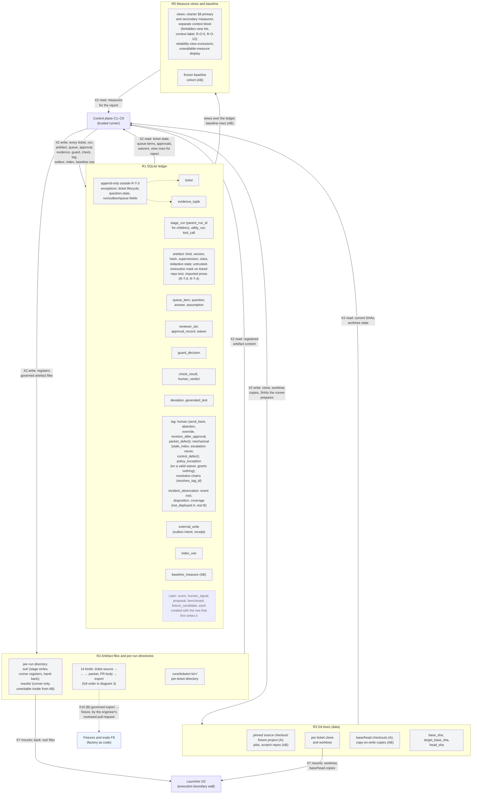
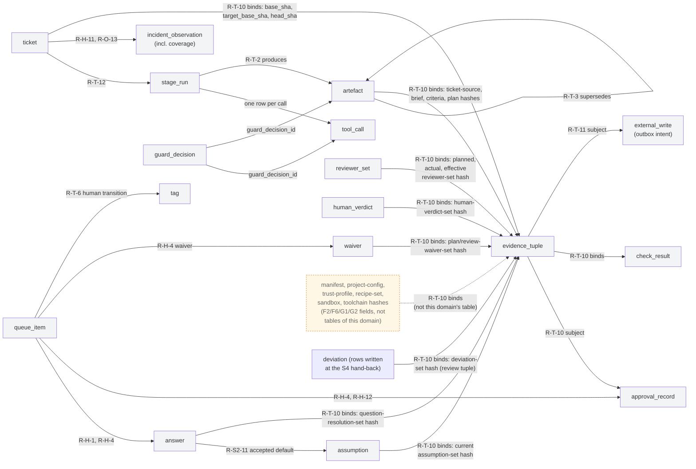
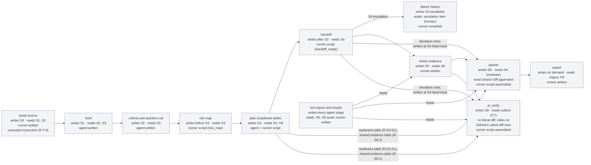

# Layer 2: Record

| Field | Value |
|---|---|
| Status | Draft v0.3 |
| Date | 2026-09-07 |
| Owner | Abhishek Thakur |
| Derived from | docs/prd/prd.md v0.18; docs/design/milestones.md v0.6; docs/charter.md v0.14 |
| Layer | Layer 2 — domain 4, Record |
| Domain rule | A component sits in the domain where its code runs or its file lives, and under whose trust it acts. **Record**: state on disk under `runs/` that the runner alone writes: the SQLite ledger, artefact files and per-run directories under `runs/`, git trees (the pinned source checkout at the path `project.yaml` names, the per-ticket clone and worktree under `runs/`), measure views and the baseline. A data block of `milestones.md` (queue item and decision, question and assumption log, approval and quorum, binding, tag) is one or more tables in the ledger, listed once there — R1 below; its contract is drawn where its rows are decided: the person's decisions in domain 1, runner-computed rows in domain 2 at the component that computes them. |

## How to read this

Three diagrams. The first shows R1, R2, R3 and R5 — the SQLite ledger's table groups (including `utility_run` and the merged `tag`/`incident_observation` group), the artefact directory, git trees, and the measure views and baseline — plus the three border stubs where another domain touches the record: a single "trusted runner" stub (C1 to C9) for every write and read-back over X2, the launcher's mounts (G2) over X7, and the one governed export that becomes a fixture (F8) over X10. The record answers only the runner; it never hands content straight to the human surface — queue items, the report and governed artefact content reach the person through C1 over X1, drawn in `L2-human-surface.md`. The second diagram shows the relationships that carry the design's integrity across tables, independent of domain layout. The third walks the artefact kinds in production order, marking which stage writes and reads each, whether the content is agent-written or runner/script-written, and naming where two or more PRD kinds fold into one node. Every crossing edge into or out of this domain passes the guard (C5) and leaves one `guard_decision` row in R1; the guard's seats are drawn once, in `L2-control-plane.md`, and are not redrawn here. Unmarked parts exist at Milestone A; `(AB)` and `(B)` mark what is built or first populated at those steps; a dotted edge or node border marks something that holds only from AB, B, or Later; grey fill marks the record (this whole file); blue fill marks the one Factory-as-code stub (F8) a crossing reaches. Left out deliberately: the full internals of C1 to C9, G2 and F8 (their own Layer 2 files), and the stage-by-stage sequence (the Layer 1 ticket-walk file).

## Diagram 1: R1, R2, R3 and R5, and the border

The SQLite ledger's table groups, the artefact directory's parts, git trees' data, and the record's measure views and baseline, with the crossings that touch another domain at this border.

## Diagram 2: the relationships that carry integrity

Only the bindings the requirement rows fix, independent of which physical table stores which side; each edge names the row that requires it. `reviewer_set`, `human_verdict` and `assumption` are drawn as nodes here for the first time, to carry the evidence tuple's inbound bindings; the dashed note carries the tuple's fields that come from outside this domain (manifest, trust-profile, recipe-set, sandbox and toolchain hashes), so the picture does not claim a table this domain does not hold.

## Diagram 3: the artefact chain

The Initial artefact kinds in the order stages produce and consume them, each labelled with the writing and reading stage and whether the content is agent-written or runner/script-written; `pr_checks_summary` is Later and not shown. Two folds keep the fourteen PRD kinds to twelve nodes: `criteria and question set` (K3) merges the criteria file and its per-round question sets; `tool inputs and results` (K9) merges `tool_input` and `tool_result`. `packet` and `pr_body` are drawn as two nodes (K11, K12), not folded, because R-S6-1 gives them different readers and a different diff rule; both share one evidence table, fed by deviation rows written at the S4 hand-back, the check evidence, the readiness table and the tool record. Deviation rows are `deviation` table rows, not a file, so no artefact-kind node carries them here; `R1_deviation` in diagram 1 is where they live. Every edge below is a plain arrow: the production order runs left to right along the chain, and thick and dotted marks are left to the meanings `README.md` gives them (the main ticket path and the AB/B/Later steps), neither of which applies to this diagram.

## Derivation table

| Component or part | `milestones.md` block | Requirement rows | First step |
|---|---|---|---|
| R1 SQLite ledger (the file) | Record (#17) | R-T-1, R-T-3, R-T-4, R-O-4, R-O-5, R-O-12 | A |
| R1 — ticket | Ticket and its state (#9) | R-T-5, R-S0-5, R-S2-12, R-H-11 | A (manual outcome fields B) |
| R1 — stage_run, utility_run, tool_call | Run (#10) | R-T-12, R-O-1, R-I-6, R-S2-3, R-S4-5, R-H-13 | A |
| R1 — artefact | Artefact (#11) | R-I-12, R-S3-14, R-S3-19, R-S3-21, R-S4-1, R-S4-2, R-S6-1, R-S6-2; R-T-2 | A (unregistered-file isolation test AB) |
| R1 — queue_item, question, answer, assumption | Queue item and decision (#12); Question and assumption log (#13) | R-H-1, R-H-12, R-S2-5 to R-S2-14 | A (full action set B via R-H-4) |
| R1 — reviewer_set, approval_record, waiver | Approval and quorum (#14) | R-S0-5, R-S5-13, R-S6-6, R-S6-7, R-H-8, R-H-12, R-F-13 | A (graduation gate B via R-O-13, R-I-10) |
| R1 — evidence_tuple | Binding (#15) | R-T-10, R-S3-15, R-S3-20, R-S6-10 | A |
| R1 — guard_decision | Guard (#23) | secondary of R-T-4, R-T-9 (0 primary rows) | A |
| R1 — check_result, human_verdict | Check (#22); Rubric (#3, human_verdict via R-S3-20) | R-S5-4, R-S5-5, R-S5-10, R-S3-20 | A |
| R1 — deviation, generated_test | folded into Artefact (ms:73 fold note, no dedicated Appendix A row); Record (generated_test, via R-T-3) | R-S4-2, R-T-3 | A (kept-share filter R-S4-7 Later) |
| R1 — tag, incident_observation | Tag (#16); incident_observation rides Ticket-and-its-state (R-S4-6, secondary tag; R-H-11, primary), Approval-and-quorum (R-H-8), Record (R-O-13, secondary) — no dedicated block | R-T-6, R-S4-6, R-H-11, R-O-13 | A (tag); A/B split (incident_observation) |
| R1 — external_write (outbox) | External access (#24) | R-T-11 | A (stub); AB (real push, R-S6-3) |
| R1 — index_use | Context index (#5) | R-S1-7, R-F-6 | A |
| R1 — baseline_measure | Record (#17), secondary External access | R-O-6 | AB |
| R1 — Later tables (score, human_signal, proposal, benchmark, fixture_candidate) | Fixtures and evals (#7); External access (#24, human_signal via R-S7-6) | R-O-10, R-F-10, R-F-12, R-S7-6, R-F-15 | Later (each created with the row that first writes it, R-T-1) |
| R1 — append-only note | Record (#17) | R-T-3 | A |
| R2 Artefact files and per-run directories | Artefact (#11) | R-T-2, R-S6-1 | A (row at AB in Appendix A: the isolation or per-run-directory enforcement it names arrives with the OS policy) |
| R2 — per-ticket directory | Artefact (#11) | R-T-2 | A (row at AB in Appendix A: the isolation or per-run-directory enforcement it names arrives with the OS policy) |
| R2 — kinds (as a group) | Artefact (#11); secondary Record (export directory, via R-T-4) | R-S3-14, R-S3-21, R-S4-1, R-S4-2, R-S6-1, R-S6-2, R-T-4 | A |
| R2 — per-run directory (out/, results/) | Sandbox (#20) | R-I-14, R-I-17 | A (results/ subpath unwritable inside AB) |
| R3 Git trees (data) | Git trees (#25) | secondary R-S4-10, R-S5-12 | A |
| R3 — pinned source checkout | Git trees (#25) | R-S5-12 | A (pilot, scratch repos AB) |
| R3 — per-ticket clone and worktree | Git trees (#25) | R-S4-10 | A |
| R3 — base/head checkouts and copies | Git trees (#25) | R-S5-12 | A (copy-on-write AB) |
| R3 — SHAs (base, target-base, head) | Git trees (#25) | R-S5-12 | A |
| R5 Measure views and baseline | Record (#17) | R-O-4, R-O-5, R-O-12 | A (baseline AB) |
| R5 — views (primary, secondary, context block) | Record (#17) | R-O-4, R-O-5, R-O-12 | A |
| R5 — frozen baseline cohort | Record (#17), secondary External access | R-O-6 | AB |
| K1 ticket source | Artefact (#11) | R-T-2 | A (row at AB in Appendix A: the isolation or per-run-directory enforcement it names arrives with the OS policy) |
| K2 brief | Artefact (#11) | R-T-2 | A (row at AB in Appendix A: the isolation or per-run-directory enforcement it names arrives with the OS policy) |
| K3 criteria and question set | Artefact (#11) | R-S3-19 | A |
| K4 risk map | Artefact (#11) | R-S3-11 | A |
| K5 plan (readiness table) | Artefact (#11) | R-S3-14, R-S3-18, R-S3-19, R-S3-21 | A |
| K6 handoff | Artefact (#11) | R-S4-1 | A |
| K8 failure history | Artefact (#11); secondary Ticket-and-its-state (R-S4-6), Approval-and-quorum (R-H-8) | R-S4-6, R-H-8 | A |
| K9 tool inputs and results | Invocation and runtime adapter (#19), secondary Artefact | R-I-17 | A (row at AB in Appendix A: the isolation or per-run-directory enforcement it names arrives with the OS policy) |
| K10 check evidence | Artefact (#11), secondary Check | R-S5-4, R-S5-5, R-S5-10 | A |
| K11 packet | Artefact (#11) | R-S6-1, R-S6-2 | A |
| K12 pr_body | Artefact (#11) | R-S6-1 | A |
| K13 export | Record (#17) | R-T-4 | A |
| C_STUB (border stub, C1–C9) | Stage interface (#18) and others; full derivation in L2-control-plane.md | X2 (Appendix B) | A |
| LAUNCHER_STUB (border stub, G2) | Sandbox (#20); full derivation in L2-execution-boundary.md | X7 (Appendix B) | A (copies and the unwritable results subpath of the per-run directory AB) |
| F8_STUB (border stub) | Fixtures and evals (#7); full derivation in L2-factory-as-code.md | X10 (Appendix B) | B |

## Not drawn

- Dashboards over the views (Later; Record #17, R-O-8) — owned by R5, the measure-views component in this domain.
- The observer pass, calibration and improvement-pass machinery that would write `score`, `human_signal`, `proposal`, `benchmark`, `fixture_candidate` (Later; Fixtures and evals #7, R-O-10, R-O-11, R-F-10, R-F-12, owned by F8; External access #24, R-S7-6, owned by C7 — both in other domains, see `L2-factory-as-code.md` and `L2-control-plane.md`) — only a placeholder (`R1_later`) is drawn, one per table, created with the row that first writes it.
- A read-only MCP server reading the record (Later; Stage interface #18, C1's register note) — owned by C1, see `L2-control-plane.md`.
- Stacked pull requests, each with its own packet (Later; Git trees #25, secondary Artefact, R-S6-8) — owned by R3, this domain's git-trees component.
- Never drawn per the brief's exclusion list, as it touches this domain: a push before quorum (no edge leaves R1_outbox before full quorum); the sandbox or its interior writing the record or the tree (no edge enters R1, R2, R3 or R5 from LAUNCHER_STUB or any execution-boundary node except the established X7 mount/hand-back leg); an approval carried past a change (R1_approval's superseded records confer no authority, per R-T-10, and no edge shows otherwise); an in-place edit of an append-only row (R1_note names the R-T-3 exceptions exhaustively; nothing else is drawn as mutable); a maintenance job recorded as a ticket-stage attempt (R1_run keeps `utility_run` as a table separate from `stage_run`, excluded from the reliability view per R-T-12).
